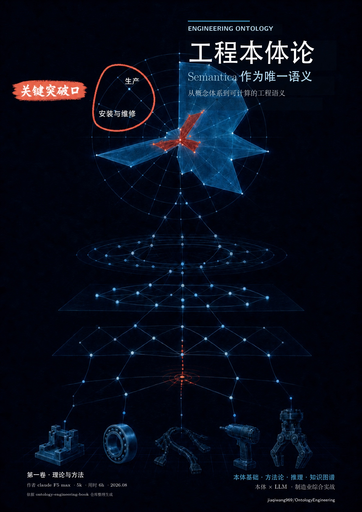
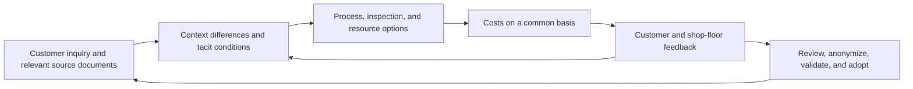

[简体中文](README.md) · **English**

# Ontology Engineering: Make Engineering Knowledge Readable, Searchable, and Verifiable

<p align="center">
  <a href="references/ontology-engineering-book/handbook/工程本体论-全书.pdf">
    
  </a>
</p>

<p align="center">
  Two books provide the theory; manufacturing methods connect customer conversations, process plans, and costs; Semantica executes the semantics.
</p>

<p align="center">
  <a href="references/ontology-engineering-book/handbook/工程本体论-全书.pdf">Read Volume 1</a> ·
  <a href="references/product-trustworthiness-book/handbook/产品可信工程-全书.pdf">Read Volume 2</a> ·
  <a href="#manufacturing">Manufacturing and costs</a> ·
  <a href="https://github.com/jiaqiwang969/semantica">Explore Semantica</a> ·
  <a href="#where-to-start">Choose a reading path</a> ·
  <a href="#a-five-minute-tour">Take the five-minute tour</a> ·
  <a href="#technical-governance">Technical notes</a>
</p>

Engineering teams rarely suffer from a shortage of documents. The harder problem is shared meaning:
which object and version are under discussion, what a piece of evidence actually supports, how far a
successful check can be trusted, and who is accountable for the final decision.

Ontology Engineering brings those questions into one coherent practice. The two books teach how to
observe and model an engineering domain. Native project records remain the source of facts. Semantica
makes the semantics executable, reproducible, and durable. Authorized people retain responsibility for
accepting facts and risks, resolving conflicts, promoting shared knowledge, and publishing it.

The bundled [manufacturing process and cost module](skills/manufacturing-process-cost/SKILL.md) applies
this method to discrete mechanical manufacturing. Start with incomplete inquiries, drawings, process
notes, equipment inventories, and quotations; uncover the conditions behind them, develop an evidenced
proposal, and use customer and shop-floor feedback to revise it.

The bundled [CAD Agent module](skills/cad-agent/SKILL.md) reads native Fusion,
NX, and AutoCAD geometry and assembly evidence. Its [bidirectional handoff](skills/cad-agent/references/cad-process-integration.md)
passes holes, interfaces, weld access, and version changes to manufacturing
decisions. The process module then reviews required functions, failure paths,
inspection, cost, and lead time; Semantica remains the formal semantic authority.

## Two volumes, two complementary questions

| Volume | The question it answers | What you gain |
|---|---|---|
| [Volume 1, *Engineering Ontology* (`工程本体论`)](references/ontology-engineering-book/handbook/工程本体论-全书.pdf) | How do we turn ambiguous engineering language into a conceptual system that can be tested? | A general method for objects and identity, relations, competency questions, open- and closed-world reasoning, constraints, inference, provenance, and ontology-guided agents |
| [Volume 2, *Trustworthy Product Engineering* (`产品可信工程`)](references/product-trustworthiness-book/handbook/产品可信工程-全书.pdf) | How can an engineering team explain why a product deserves trust? | An ISO 26262 ontology-engineering walkthrough and ten reusable lenses: claims, identity, governance, contextual hazards, requirements, measurement, change, dependency, field evidence, and assurance |

Volume 1 provides the reusable grammar; Volume 2 shows that grammar at work in difficult product
decisions. The people, incidents, EPS-RC17, ENV-01, and numerical values in Volume 2 are synthetic
teaching material. Exact ISO clauses, tables, and wording must be checked against a lawfully held,
controlled source. This project is not an official interpretation, certification, or conclusion about a
real product.

## Who this is for

- Manufacturing business owners deciding whether they can make a new customer's product, how to plan
  production, and what costs to include;
- Engineers and technical leads who need sharper boundaries around objects, terminology, versions,
  evidence, and responsibility;
- teams building enterprise knowledge graphs, industry ontologies, digital threads, or engineering
  knowledge systems;
- developers who want LLMs and agents to operate within explicit semantic, evidence, and authority
  boundaries;
- reviewers who must decide whether a green check genuinely supports a risk, compliance, or release
  claim;
- readers who want methods, worked examples, and reproducible semantics in one learning path.

## Where to start

| Your goal | Suggested route |
|---|---|
| Learn ontology engineering from first principles | Volume 1, Chapters 1–3: why ontology matters, core concepts, and how to begin with competency questions |
| Work on RDF/OWL, constraints, or reasoning | Volume 1, Chapters 4–5 and 7, then corroborate the examples with their Semantica chapter packages |
| Understand semantics for LLMs and agents | Volume 1, Chapter 8, followed by the engagement rules in [`SKILL.md`](SKILL.md) |
| Build a trustworthy-product or functional-safety evidence chain | The preface and Chapters 1–10 of Volume 2, then the paired ontology answers in Chapters 11–20 |
| Apply the method to a live engineering project | Start with the [`Semantic Engagement Contract`](references/semantic-engagement-contract.md) |
| Check manufacturing and sealing functions against CAD | Use the [CAD Agent module](skills/cad-agent/SKILL.md) and [bidirectional evidence handoff](skills/cad-agent/references/cad-process-integration.md) for native geometry, provenance, function coverage, and change impact |
| Turn a customer inquiry into a process and cost proposal, then revise it from feedback | Start with the [manufacturing module](skills/manufacturing-process-cost/SKILL.md): anonymized cases, work norms, record templates, and XeLaTeX report components |

<a id="manufacturing"></a>

## Manufacturing and costs: connect conversations, proposals, and feedback

The current method is **0.5.4**, for discrete mechanical manufacturing. Each project supplies its own
industry context, materials, process parameters, and acceptance criteria. The reusable part is how to
find missing knowledge, connect evidence, compare options, and verify decisions. Detailed guides and
example outputs are currently in Chinese.



| The decision at hand | Methods and reusable resources |
|---|---|
| Which documents or answers can change the decision? | [Source documents and conversation filtering](skills/manufacturing-process-cost/references/high-value-documents.md): retain provenance, conditions, conflicts, and counterevidence; ask questions tied to the current decision |
| Can an existing process transfer, and what drives precision or equipment requirements? | [Requirements, processes, and costs](skills/manufacturing-process-cost/references/requirements-process-cost.md) and [STEP to process planning](skills/manufacturing-process-cost/references/step-to-process.md): connect critical features, intermediate states, workholding, inspection, and equipment functions |
| Should we make, outsource, reuse equipment, or develop a machine? | [Estimate bases and batch charges](skills/manufacturing-process-cost/references/estimate-basis.md) and [twelve decision patterns](skills/manufacturing-process-cost/references/decision-patterns.md): compare equivalent quantities and scopes, distinguish quotes from estimates and measurements, and choose decision-relevant validation |
| How can the proposal expose its supporting evidence? | [XeLaTeX report components](skills/manufacturing-process-cost/references/report-design.md), [five editable process-diagram templates](skills/manufacturing-process-cost/references/process-flow-templates.md), and a [diagram preview](skills/manufacturing-process-cost/assets/report-template/flowcharts/preview.pdf) |
| What needs rechecking after a correction or revision? | [Evolving case](skills/manufacturing-process-cost/references/case-evolution.md), [work norms](skills/manufacturing-process-cost/references/work-norms.md), and [organizational follow-through](skills/manufacturing-process-cost/references/organization-loop.md): record reasons, trace dependencies, and connect responsibilities to the next round |

The module includes [eight record templates](skills/manufacturing-process-cost/SKILL.md#按需要取用),
[six optional review cards](skills/manufacturing-process-cost/assets/templates/decision-review-cards.md),
and [four rounds of report inputs plus five later decision exercises](skills/manufacturing-process-cost/assets/report-template/example/README.md).
The cases show information arriving over time, conclusions changing, and questions reopening. Report
views follow the current decision; historical A/B/C labels are not fixed manufacturing stages.

STEP-to-process support currently consists of analysis and review methods. The report component takes
prepared records and generates native TeX, with optional PDF compilation. Process diagrams are edited
against project records; real capability and savings require field evidence. Generic material preserves
causal relationships and counterexamples. Customer originals, identities, actual quotations, models,
and conversations stay in the project's private workspace.

## A five-minute tour

Get the complete repository, then run the examples from its root:

```bash
git clone https://github.com/jiaqiwang969/OntologyEngineering.git ontology-engineering
cd ontology-engineering
```

You can read both PDFs without installing a runtime, or search the fixed book sources by topic:

```bash
python3 scripts/search_ontology_sources.py --scope book \
  "对象身份 identity evidence authority"
```

The results point to a volume, chapter, and repository-local source anchor, so you can continue into the
relevant TeX, Markdown, chapter guide, or PDF.

With Python 3.10+, generate your first report's TeX and frozen input records from a synthetic example,
then verify the input-to-output correspondence:

```bash
python3 scripts/manufacturing_report.py generate \
  --input skills/manufacturing-process-cost/assets/report-template/example/03-resource-cost.json \
  --output ../work/manufacturing-report-001
python3 scripts/manufacturing_report.py verify ../work/manufacturing-report-001
```

Use a new output directory outside the skill. Add `--compile` to generate a PDF; this requires XeLaTeX,
the usual Chinese font packages, and Poppler. See the [report guide](skills/manufacturing-process-cost/references/report-design.md)
for dependencies and page-by-page review. These commands check record mappings, file hashes, and cost
arithmetic. Engineering semantics for the report's own snapshot require separate Semantica verification.

<details>
<summary>Try source-locked Semantica discovery</summary>

Preflight the environment, install and audit the pinned runtime, then discover packages without changing
any registry state:

```bash
bash runtime/setup_runtime.sh --preflight
bash runtime/setup_runtime.sh
bash runtime/setup_runtime.sh --doctor
runtime/.venv/bin/python scripts/semantic_engagement.py discover
```

Missing files, version drift, or hash mismatches fail closed. The workflow never silently falls back to a
different RDF/OWL backend.

</details>

## Portable distribution

The [0.5.4 update notes](docs/releases/manufacturing-method-0.5.4.md) describe the CAD/manufacturing integration, causal challenge gate, and public distribution scope. This release follows the public 0.5.3 method.

| Component | Current version and scope |
|---|---|
| Manufacturing method | `0.5.4`; conversations, CAD evidence handoff, processes, costs, feedback, and reuse |
| Record templates / review cards | `0.2.1` for two templates, `0.2.0` for the others / cards `1.4.1` |
| Reports / process diagrams | `1.0.0`; XeLaTeX and five editable TikZ templates |
| Frozen manufacturing semantic package | `0.1.1`; 141 declared assets, 68 synthetic scenarios, and 23 CQs; retains its local technical candidate state |

Keep the complete `ontology-engineering/` root when distributing or using the skill. Theory references,
case assets, and execution tools are all inside it; copying just the manufacturing submodule omits its
dependencies. Follow [portable distribution and receiver checks](docs/PORTABLE-DISTRIBUTION.md) to
check, package, and replay it without the original customer project or author workspace. Initial Python
dependency installation may still need a package index.

The [0.5.4 public asset ledger](https://github.com/jiaqiwang969/OntologyEngineering/releases/download/manufacturing-v0.5.4/ontology-engineering-core-v0.5.4-assets.json), the preceding manufacturing release's [frozen asset manifest](https://github.com/jiaqiwang969/OntologyEngineering/blob/b5b148333a39b69aaa8b5b521de8242805cc3838/docs/releases/manufacturing-method-0.5.3.json),
this [README update manifest](docs/releases/manufacturing-readme-0.5.3-r1.json), and the
[semantic package NOTICE](runtime/vendor/MANUFACTURING-NOTICE.md) retain their separate scopes.
The distribution guide explains the limits of file checks and synthetic replay. Manufacturing-method
publication is recorded separately from the [whole-book publication status](docs/PUBLIC-RELEASE-STATUS.md).

## The relationship in one picture

```text
The books: how to observe, question, and model ─────┐
Project evidence: what actually happened ──────────┼─→ one semantic engagement
Authorized people: what may be accepted or shared ─┘             │
                                                                 ▼
                                              Semantica: sole executable semantics
                                                                 │
                                                                 ▼
                                      engineering result + semantic result + learning verdict
```

These roles are intentionally non-interchangeable. Books are not project evidence. Semantica does not
accept risk on a person's behalf. A project record does not automatically become an industry rule. Human
approval does not replace a reproducible semantic check.

## Go deeper

Implementation and governance material is collapsed by default. Start with the books; open these notes
when you are ready to connect a project or maintain the repository.

<details>
<summary><strong>The fast and slow loops behind each engagement</strong></summary>

### The fast inner loop

The fast inner loop runs for each engineering task:

```text
task and project binding
  → choose a method lens from the books
  → discover existing semantics and capabilities
  → align objects, identity, evidence, and authority
  → run applicable checks and authorized engineering work
  → return the engineering result, Semantica result, and learning verdict
```

Default engagement does not mean default ontology mutation. When the work teaches nothing reusable, the
correct verdict is `no_delta`. Only stable, sourced, reusable knowledge enters the slower governance loop:

```text
candidate → proposed → committed → regression_passed
          → release_complete → promoted → published
```

The states cannot be skipped. A `candidate`, a `committed` version, and even technical
`release_complete` do not mean public release. `published` always remains an external, authorized
decision. See the [`domain-ontology-loop`](skills/domain-ontology-loop/SKILL.md) for the full outer loop.

</details>

<details>
<summary><strong>Book sources, TeX, and PDFs</strong></summary>

The two PDFs are formal build artifacts, but neither is the sole source of the book:

- Volume 1 is maintained through its volume and chapter guides, authored XeLaTeX, figures, and authoring
  tools. Fragments generated from Semantica are controlled publication snapshots, not a second semantic
  implementation to edit by hand.
- Volume 2 takes its content from the preface, twenty `chapter.md` files, four Markdown appendices, and
  TeX assembly sources. Its fragments are produced deterministically.
- Authoring locks record the exact sources and assets consumed by a build. A PDF never replaces its
  Markdown, TeX, figures, or locks.

The build entry points are the
[`Volume 1 handbook`](references/ontology-engineering-book/handbook/README.md) and
[`Volume 2 handbook`](references/product-trustworthiness-book/handbook/README.md). For changes spanning
book text, Semantica, and PDFs, follow the
[`two-book authoring and convergence workflow`](references/book-authoring-workflow.md).

</details>

<a id="technical-governance"></a>
<details>
<summary><strong>Technical and governance notes</strong>: source lock, 29 chapter packages, and the candidate-only boundary</summary>

The statements below describe the bytes pinned today; they are not promises about another branch or an
authorization to publish:

| Area | Current, verifiable state |
|---|---|
| Semantica runtime | [`0.6.5+oe.6`](runtime/semantica-source-lock.json), pinned to an exact source commit and wheel SHA-256. Doctor also verifies every package file against the wheel `RECORD` and checks the real import root |
| Executable semantics | Ontologies, CQs, SHACL, queries, supported rules, cases, contracts, PROV, receipts, and lifecycle state have one executable home: Semantica. OE carries no second backend, fallback, or parallel registry |
| Chapter packages | 29 total: 9 for Volume 1 and 20 for Volume 2. Volume 1 Chapter 6 is `absent`; the other 28 are `partial`; all 29 have `release_status=blocked` |
| Normative-derived package | A separate `semantica.chapter_packages.vol2.normative` domain package is also `partial/blocked`. It is neither a copy of ISO text nor a compliance opinion |
| Frozen manufacturing cases | `semantica.manufacturing.process-cost-loop@0.1.1` travels with the root and runs through Semantica; its 68 synthetic scenarios have a separate scope from chapter packages, new project reports, and industry promotion |
| Two-book artifact v1 | It can only be a technical `candidate`. Rights and publication records accept only `pending` or `blocked`; unsigned JSON, green tests, or package receipts cannot authorize public release |

Canonical contracts and status pages:

- [`Semantic Engagement Contract`](references/semantic-engagement-contract.md): task binding, evidence,
  authority, the three-part result, and failure semantics;
- [`Semantica source lock`](runtime/semantica-source-lock.json): the current commit, version, wheel, and
  verification baseline;
- [`Two-book artifact v1 evidence contract`](references/release-evidence/README.md): the candidate-only
  technical closure;
- [`Whole-book publication status`](docs/PUBLIC-RELEASE-STATUS.md): currently `BLOCKED`; the authorized
  manufacturing-method upload has its own manifest above;
- [`Privacy, sources, and public release`](docs/PRIVACY-AND-RIGHTS.md): the default-deny and allowlist
  boundary;
- [`Adding a book`](docs/ADDING-A-BOOK.md): the controlled path from a lawfully accessed standard to a
  readable book and Semantica package.

### Minimum maintainer gates

```bash
runtime/.venv/bin/python scripts/check_semantica_backend_policy.py \
  --root . --policy runtime/semantica-backend-policy.json --mode strict --json
runtime/.venv/bin/python -m pytest -q tests
```

### Repository map

```text
SKILL.md                         default semantic engagement and routing
ontology_engineering/            source-locked Semantica adapter
runtime/                         wheel/source lock, setup, and doctor
runtime/vendor/                  pinned runtime and frozen manufacturing case transport
references/ontology-...-book/    Volume 1 sources, TeX, figures, and PDF
references/product-...-book/     Volume 2 sources, TeX, figures, and PDF
references/                      source maps, contracts, and release evidence
skills/domain-ontology-loop/     governed industry-ontology outer loop
skills/standard-to-book/         controlled standard-to-book workflow
skills/cad-agent/                native CAD, Fusion execution, and manufacturing evidence handoff
skills/manufacturing-process-cost/ methods, anonymized cases, records, reports, and diagrams
docs/PORTABLE-DISTRIBUTION.md     whole-root distribution and receiver checks
docs/releases/                   versioned update notes and public asset manifests
scripts/                         search, reports, case replay, distribution, and gates
tests/                           contract and regression tests
```

</details>

> The books teach us how to look. Project evidence tells us what happened. Semantica makes the meaning
> executable and durable. Authorized people decide what may be accepted, promoted, and published.
