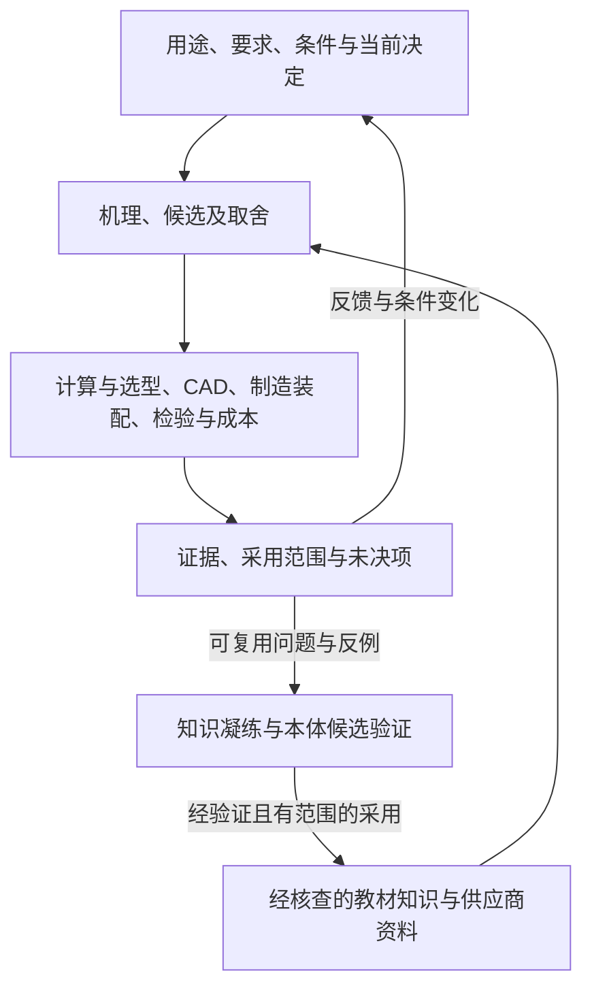

# 统一架构与下一版升级：工程本体统筹机械设计

状态：持续工程优化计划。0.7.0 先交付完整、可安装的软件与方法；本文描述的整书
本体化、功能实现与真实工程闭环继续通过后续案例迭代，不作为已完成能力宣传。
软件分发不改变正式语义包、原生工程结果或实物验收。验证只覆盖其冻结字节。

## 初衷与整体的判据

本项目帮助用户从用途与功能出发，在精度、刚度、寿命、制造装配、成本、维护和供货
等实际条件下提出、比较、验证并反复改进方案。用户用日常语言说明目标；根 skill
续接同一项目，形成当前待决问题、候选、依据、未知和下一项有价值的工作。

整体以工程决定为中心。一次选型的原理依据、产品限制、计算输入、NX 对象、工艺、
检验和成本应能互相定位；新证据或条件变化能够回到相应决定。只在同一包中放入
资料和工具，或分别跑通接口，尚未达到这一判据。

两种工作共用方法与证据：**知识建设**把来源变成可提问、可核查的领域知识；
**工程使用**将适用知识与实际输入结合，产生工程结果并反馈。前者有整书覆盖计划，
后者按当前问题调用；一次项目实例不自动成为通用规律，单个示例也不限定教材范围。

## 方法、知识与事实各有位置

| 内容 | 在整体中的作用 | 复用及边界 |
| --- | --- | --- |
| 第一卷《工程本体论》 | 对象、身份、关系、CQ、约束、来源与推理边界 | 指导怎样建模，不充当项目参数源 |
| 第二卷《产品可信工程》 | 从领域材料形成主张、条件、验证和变化关系的方法示范 | 抽象可复用模式；保留其行业适用范围与合成案例身份 |
| 共用工程模式 | P-ID、P-CLAIM、P-SCOPE、P-REALIZE、P-CHANGE | 正式定义及可执行检查由锁定 Semantica 包提供 |
| 四本机械教材 | 元件设计、机构运动、精度计量、制造装配与经济方法 | 按工程问题跨书建模；新增必要领域差异，不逐书复制一套本体 |
| 米思米目录 | 具体实现、产品族、配置、规格、选型与工艺限制 | 产品族、完整型号及目录版本分别识别，名称相似不建立同一性 |
| 项目记录 | 实际对象、修订、要求、工况、候选、主张、决定和证据 | 原项目是事实与状态正本，模块通过明确映射交接 |
| 工程工具与交付物 | 计算、NX、工艺检验、成本和报告 | 产生及呈现同一项目的证据；文件生成不等于物理成立 |

五个模式不能代替机械领域内容。例如载荷、支承、材料、摩擦、自由度、公差链、
加工能力与成本范围需要有来源的对象和关系；是否新增正式表达要看已有包实际覆盖。
公式须连起变量、单位、假设、适用域、计算实现和独立校核，不能把公式字符串或
模型评分当计算能力。Semantica 检查记录与关系，数值计算和实物验证由相应工具执行。

## 统一对象链与现有入口

一次跨模块决定保留以下联系，字段沿现有记录映射，不新建万能项目 schema：

**决定／要求 → 候选机制或模型 → 有条件的产品配置联系 → 零件、实例与接口
→ 计算、制造及检验证据 → 采用范围、成本取舍与重审条件。**

| 需要连接的工作 | 现有承载位置 | 交接必须回答什么 |
| --- | --- | --- |
| 当前目标、需求和缺口 | [discovery-record](../../skills/manufacturing-process-cost/assets/templates/discovery-record.json) | 当前决定、对象修订、条件和未决问题是什么？ |
| 候选、机理与取舍 | [solution-record](../../skills/manufacturing-process-cost/assets/templates/solution-record.json) | 哪项功能由什么实现，支持、反驳和未知各是什么？ |
| 教材及供应商来源 | [知识入口与证据包](../../references/supplier-knowledge.md) | 原页说了什么、适用于谁、被哪项主张采用？ |
| 计算与证据适用 | [工程证据方法](../../skills/engineering-evidence-methods/SKILL.md) | 数值来源、单位、模型假设和判据是否匹配？ |
| NX 原生对象 | [nx_direct](../../skills/cad-agent/scripts/nx_direct.py)、[CAD 证据](../../skills/cad-agent/contracts/cad-evidence.v1.schema.json) | 完整配置和要求对应哪个原生对象、特征及修订？ |
| CAD 与制造双向交接 | [CAD／工艺合同](../../skills/cad-agent/references/cad-process-integration.md) | 哪个接口影响工序与检验，工艺限制又要求设计改什么？ |
| 成本、资源及活动 | solution-record、[组织运行记录](../../skills/manufacturing-process-cost/references/organization-loop.md) | 比较是否同版、同量、同范围，未知费用和能力在哪里？ |
| 变化与反馈 | [revision-record](../../skills/manufacturing-process-cost/assets/templates/revision-record.json)、[工程迭代](../../references/engineering-iteration.md) | 哪些支持关系需重审，哪些仍适用，哪些依赖未查清？ |
| 正式审查与采用 | [semantic engagement](../../references/semantic-engagement-contract.md)、[judgment governance](../judgment-governance.md) | 使用哪个已采用包和有界输入，检查、采用与发布分别到哪里？ |

稳定业务 ID 和对象修订跨模块共享；不同文件格式可以保留。CAD 面编号只定位该版
模型，教材概念不能充当实物 ID，供应商系列不能充当完整配置。讨论原理时允许没有
项目身份；一旦用于工程采用，必须明确目标决定和对象，缺项就保留未采用状态。
自动核验尚未补齐的交接由 agent 逐项记录身份与修订对应；字段同名或格式相同不证明
实际指向同一对象，不能把待实现的共用身份要求写成当前检查已经通过。

必要功能与硬约束先核查。精度、成本、维护等目标保留可解释取舍；没有权重或同口径
证据不制造唯一总分。每次查书、计算、设计或试验说明会改变哪个决定，结果回到相同
判据比较；达到当前验收或资源边界后保留未知，避免无限迭代。

## 教材本体化、米思米联系与原图引用

先登记每本书的实际版次、原件身份、完整目录与提取质量，再按领域模块持续记录：
待读、已核原页、候选表达、已验证方法、正式语义覆盖及项目使用。它们是工作覆盖
记录，不是另一个 Semantica 生命周期。目录级映射不算完成全文本体化。

跨书围绕工程问题合并重复内容，保留来源、条件和分歧。例如精度问题可同时使用
元件设计的支承条件、计量教材的公差方法、米思米的安装限制及制造装配的成本方法。
联系分别表达“解释机制”“计算适用”“规格限制”“支持接口要求”等意义，先作为
候选核查；主题相关不证明方法适用，也不允许把多个来源直接写成 sameAs。

每条采用依据能够回到：书名／版次＋原 PDF SHA＋物理页＋已核印刷页＋图表公式定位。
原页按需渲染，派生图保留独立身份；局部放大仍能打开整页和相关邻页。原生文本、
扫描转录、视觉解读和人工复核分别记录。公式符号、表格行列、脚注、跨页条件和勘误
在数值采用前回查。教材与米思米原页可以并列显示，保留各自支持的主张。

原件只保留一个受控来源，索引与按需图片缓存为派生物；凝练知识保留必要引用，
不把全书文本、重复图像和临时产物写进核心指令。精简以仍可回答 CQ、识别反例和
回看原页为标准，不能以删掉适用条件换体积。具体过程见[书源方法解释](../../references/supplier-knowledge-interpretation.md)。

## Agent、Jev、工具与 Semantica

根 agent 理解意图、提出问题和表示候选、读原图、整合结果并维护采用理由。
Jev 共用既有 instruct 与五组模式，辅助选择资料、匹配模式、比较条件与概念、判断
领域细化和下一核查。需要新概念表达或复杂推导时由 agent 与专业工具完成；Jev
输出选择及概率，不独立完成教材抽取、数学求解或正式本体创建。

专业工具产生计算、CAD、测量与制造证据。Semantica 仍是唯一正式语义权威，按实际
能力、项目绑定和本轮输入执行；知识候选不自动成为已采用断言。原始资料、凝练
知识、模型建议、工程结果和正式审查各有来源，任何一个总状态都不能代替它们。

## 当前事实与最重要的断点

已具备共享 instruct 与五 ODP、米思米原页及片段身份检查、CAD／工艺对象与修订
校验、正式断言审查与采用入口，以及各自的软件测试。四本教材已有整书目录级候选
地图和少量原页核查；这不是全文机械本体或已完成的工程项目。

来源接入已继续实现：本地 PDF 登记与原生文字索引接入同一 CLI；来源分配有限候选，
共用 Jev 主题、章节、正文与后审。整书指定页和米思米独立单页均可按需生成带哈希
的完整图片。原项目快照可带 `decision_id`，证据包交接会识别身份未绑定或快照变化。
导航别名与扫描页未知状态保留；这些能力仍不把片段转成已验证机械规则。

当前实现仍有五个需要真正接通的地方：

1. **决定身份。** 知识包已核同一快照的决定、项目和对象修订；根路由、原项目及
   CAD／制造的实体映射仍需补齐。概念讨论允许未绑定，不能自动转作工程采用。
2. **来源到主张。** knowledge_units 还是段落候选；原图、公式、条件的复核及其
   到 assertion、采用理由和审查义务的交接尚未成为完整可重放链。
3. **通用资料与图引用。** 本地教材与米思米查询、证据包及整页图片已接通；扫描
   转录、图表公式的细粒度定位和逐项视觉／数值核查仍未覆盖全集。
4. **知识到工程对象。** 教材模型、供应商完整配置与实际 CAD 接口、工艺和成本条目
   之间尚有人工对应；已有 CAD→工艺实桥可以复用，无需重建。
5. **整体变化反馈。** 当前能识别知识包使用的快照已变化；教材条件→规格→计算→CAD→
   工艺／成本的支持链未整体建立，快照不同不自动说明哪些工程结论失效。

按依赖推进：先核身份和来源引用，再形成有条件主张及其采用映射；随后将领域 CQ
和计算义务接到 CAD／制造／成本证据，最后验证变化反馈。知识内容按全书领域逐步
覆盖，每个完成模块须有正例、反例和未知例；不等四书全部处理完才允许有界使用。

## 整体验收与发布准备

验收覆盖多种任务，不绑定某一本书或某一个机构：

- **知识建设：** 从原页形成可追溯 CQ、领域对象关系、模型条件与反例；说明复用
  哪个模式及真正新增什么，未读或未验证部分可见。
- **跨来源与引用：** 同一决定同时使用教材与供应商依据，打开正确版本的原页图；
  型式、单位、配置和条件错配被识别，资料不足保持未知。
- **真实工程使用：** 至少一个完整项目实际完成有条件计算和独立核对、NX 保存与
  独立重开、工艺装配检验及成本交接；同一对象链可追溯。合成输入须明确标记。
- **多因素与反馈：** 分别用精度／成本取舍、制造能力变化、规格或需求变化等任务
  核查重审范围。旧结论不能直接继承，仍有效与未知依赖各有说明。
- **知识复用：** 凝练方法在另一个适用任务中被实际使用，同时有一个不适用反例；
  开发者自拟答案不冒充独立 Jev 准确率。
- **可移植使用：** 接收者在新位置接入声明的资料组件，可以查询、回看原页并运行
  可用链路；没有作者路径、账号、项目事实或隐式环境依赖。

已有“直线往复后增加旋转”的导向模块只保留为可选开发案例；它既不是用户项目，
也不是整书覆盖标准。案例按待验收的真实断点选择，不能用跑通一例宣称全部设计链完成。

正式 release 前至少 **10 轮有记录的整体检查、改进与复测**；按发现和验收主题区分，
不把同一测试重复运行凑轮数。既有 [12 轮候选记录](../ENGINEERING-ITERATIONS.md)属于此前
冻结的软件与来源包，不自动覆盖本次新教材和新交接。轮数、测试通过不能消除未完成项。

代码／方法、原件完整性、文字／图形覆盖、正式语义、原生工程和发布状态分别报告。
核心保持小而自足；原始教材、完整 MISUMI 无损压缩来源及大型索引在下一版独立经
Drive 交付。核心包含代码、方法、来源清单和下载接入说明，不携带原始大书、缓存或
维护者环境；必要的小型模板示例保留。来源已通过 gws 上传并完成逐文件大小、MD5
与 SHA-256 校验，下载定位、来源版本、字节数和哈希统一见[来源交付清单](../../runtime/source-delivery.json)。
访问受限，接收方权限尚未验证；共享权限未变，上传验收不构成新版发布。接收方下载后将原件回填 skill 的 `sources/books/`、`sources/misumi/`，
索引在 `sources/.indexes/`，形成完整本地目录；Git 与核心打包排除 `sources/`。
安装／登记后核查混合检索和原页引用，账户或 Drive 不参与每次离线查询。
原图与细节按字节完整性保留；传输位置变化不算知识凝练或教材本体化完成。
只有最终实现、候选清单、环境和证据一致
才形成下一候选；保留旧清单与旧产物，不修改旧批准来宣称新版已经发布。
