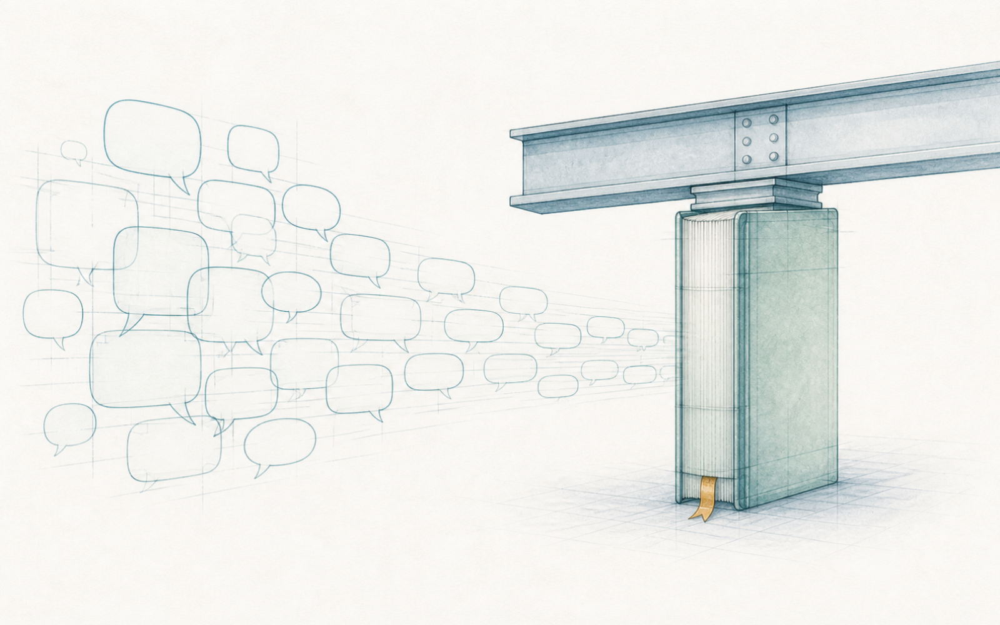
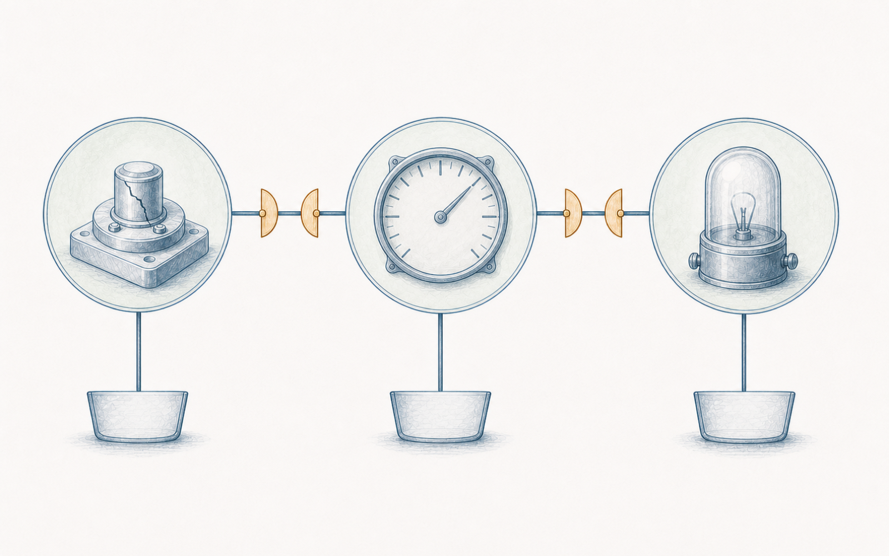

# 第 2 章 先把词说清：从同名之争到术语体系

> Semantica 绑定： 本章保存术语辨析与工程方法；唯一机器语义是
> `semantica.chapter_packages.vol2.ch02`，主场景为
> `semantica.vol2.ch02.scenario.primary`。术语对象、本体、CQ、查询、Shape、
> 正反案例、规则、oracle、manifest、PROV 与 receipt 均在该包中，本目录不设
> 运行副本。当前状态为 `partial`、release `blocked`。ISO 定义的原文权威仍在
> 用户合法持有的标准；`semantica.chapter_packages.vol2.normative` 只保存本书的
> 工程释义与教学映射。

> **【导读】**
> 第 1 章散会时，白板中央的三个字母在四个人眼里是四个东西。本章不急着发明新办法，
> 而是先回到一个常被跳过的事实：这场争吵，功能安全这个行业早就吵过了，
> 而且把停战协议写成了一整卷术语——这是 AI 出现之前，人类工程共同体干过的
> 最了不起的语言工程之一。本章陪你走过这卷语言的承重墙：相关项、系统、元素怎样
> 划分分析边界；故障、错误、失效为什么是一条链上的三个位置；四个都写着
> “一百毫秒”的字段为什么不是同一种时间；ASIL 为什么是风险的语言而不是荣誉的语言。
> 走到最后，我们也会诚实地看到这套纸上语言到不了的三个地方——它们正是后十章的入口。
> 读完本章，你应当能把一句含混的工程话改写成标准的语言，
> 并说出这套语言在哪里到头。

## 2.1 白板上的争论，这个行业早就吵过了

周一早上，白板上的“EPS”还没擦。陈工把上周的任务单过了一遍，
然后把新入职的系统工程师小蔡介绍给大家——她从消费电子行业跳过来，今天第一天到岗。

小蔡的第一个问题就让会议室安静了：“你们说的 EPS，指的是那个功能，还是那块控制器？
我看架构文档里写 EPS，台架记录里也写 EPS，好像不是一回事。”

有人笑了：“干这行的，心里都有数。”

这句话一点都不外行——它是每个成熟团队的真实经验：老搭档之间确实有默契，
一个眼神就知道对方在说哪一层。但小蔡的存在本身就是反例：默契不会写在入职材料里。
新人要靠犯错来学它，供应商靠猜测来学它，而下周要接入审核的第三方审核员，
根本没有机会学它。靠默契维持的语言，覆盖半径只有一张熟人餐桌。

于是有人提议：那就发一份内部术语表，把常用词都定义一遍。这个方案也不外行——
很多公司真的做了。但做过的人知道它的两个死穴：第一，术语表定义的是**词**，
判定不了**对象**——它能告诉你“控制器”这个词的意思，却不能告诉你台架记录里
那个“EPS”指的是不是软件构建；第二，术语表自己会繁殖：主机厂一套、
三家供应商各一套，合作越深，表越多，对照表比术语表还厚。

第三个提议最硬气：“别自己编了，直接按标准来。”这个方向是对的，
但落地时常常变成一句空话——标准的术语卷谁都知道存在，通读过的人寥寥无几；
更没人告诉过团队，几百个术语里哪些是承重墙，哪些是脚手架。

这正是本章要做的事。但在走进去之前，值得先停一秒，看清这卷术语是什么。

它不是官僚文书。汽车功能安全这个行业，几十年里在同样的争吵上付过真实的学费：
“失效”和“故障”混用，导致处置走错门；“系统”边界不清，导致责任落空；
时间参数张冠李戴，导致机制看似达标实则无效。这一卷术语，是整个行业
替所有后来者吵完了架、验完了尸之后，把结论写成的**停战协议**。
在没有 AI 的年代，把几百个含混的行业黑话逼问成精确定义，再让全球的
主机厂、供应商和审核员说同一种语言——这是人力所能做到的最大规模的语义对齐。

**术语体系不是给会议增加负担的文书，而是一个行业为自己的争吵付过学费之后，写下的停战协议。**

为什么每家公司自己的术语表活不过三年，而这一卷标准的术语活了几十年？
因为公司的术语表由文档部门维护，标准的术语由事故维护——每个定义背后都
压着一次付过学费的争吵。一个定义的权威，从来不来自发布它的机构，
来自它替后来者省掉的那些重复损失。

所以本章的路线是：带着白板上那场争论，去标准的语言里找它早已写好的答案——
先给“东西”找座位（相关项、系统、元素），再给“坏”找位置（故障、错误、失效），
再给“快”找宿主（四种时间间隔），最后给“严”找刻度（ASIL）。

## 2.2 相关项、系统、元素：分析边界的名字

先回答小蔡的问题。功能安全的语言里，给“东西”准备的座位不止一个，
因为分析需要的边界不止一种。

**相关项（item）**是功能安全生命周期的分析起点：在车辆层面实现一项功能
（或功能的一部分）的那个系统或系统组合。说“EPS 相关项”，指的是
“为驾驶员提供转向助力”这项车辆功能所对应的完整边界——方向盘上的转矩传感器、
控制器、助力电机、传到齿条的机械路径，凡是这项功能成立所需要的，都在边界之内。
整车工程师上周在白板前想到的“一辆车上的转向”，坐的就是这个座位。

**系统（system）**有一个容易被忽略的最低门槛：它至少要把传感器、控制器和
执行器关联起来——相关的传感器或执行器可以在系统内部，也可以在边界外部，
但一个孤零零的控制盒子不构成这里所说的系统。EPS 相关项之内，
“转矩感知—计算—电机执行”这条链构成一个系统；它是系统工程师做架构分析时的座位。

**元素（element）**是个统称：系统、部件、硬件零件、软件单元，都可以在某次分析里
被称为元素。它不是插在“系统”和“部件”之间的一个固定夹层——这是最常见的误读。
说“元素”，是在说“本次分析正在处理的那个单位”，而不是在给零件定终身级别。
同一块 H3.2 控制器，在整车级分析里是 EPS 系统的一个部件，
在控制器级分析里自己就是被分解的对象；换一个分析，同一个东西合法地换座位。

这三个词有一个共同点：**它们是分析边界的名字，不是零件的名字。**
零件躺在货架上不会自己变成相关项；是分析任务把边界画在哪里，决定了它这次叫什么。
把某个语境里的座位焊死在对象身上，再带进所有其他任务——上一章白板前的
四种理解，一半的病根在这里。

那另一半呢？小林上周想到的“软件构建 SW1.8.3”，在这三个座位里都坐不下。
它不是相关项，不是系统，也不是那种意义上的元素——它是一个**工件**：
工程活动产生和使用的东西。需求文档、架构模型、源代码、构建包、测试报告、
标定文件，都是工件。工件可以**描述**产品、**规定**功能、**实现**软件、
**记录**证据，但它不会因为文件名里写着 EPS，就变成那台产品。
把描述物当成被描述物，是四种理解里最隐蔽的一种错位——
一份写着“EPS 架构”的文档躺在评审桌上，桌上并没有出现一台 EPS。

现在可以回头给白板上那场争论发座位牌了：整车工程师说的是相关项；
系统工程师说的是系统；硬件工程师说的是一个元素（H3.2 控制器）；
小林说的是一个工件（软件构建）；郑工台架上的 P07 是一台具体的物理样机——
它在那次试验里扮演“被测对象”的角色。五个人都没说错，
他们只是各自坐在不同的分析边界里，而白板上只写了三个字母。

争吵的解药不是禁止简称，而是**在交接的地方把座位说出来**。
这正是标准语言的用法：不是让所有人天天念全名，而是在边界交接、
证据流转、责任移交的关口，把“我说的是哪个座位上的东西”讲清楚。

座位分好了，下一个问题自然浮出来：东西清楚了，“坏”呢？
三个专业各自嘴里的“故障”，是同一件事吗？

## 2.3 故障、错误、失效：一条链，三个词

先讲那个乌龙。几周前的一个早上，质量群里弹出一条来料检验消息：
“R17 批次异常，请相关方关注。”十分钟内，消息被转进了项目群——
候选代号 RC17 出了批次问题？陈工的电话被打爆，台架当天的排期被临时挂起，
一场紧急会拉了七个人。四十分钟后，硬件负责人在会上举起一块电路板：
“R17 是这颗电阻的位号。来料批次的失效率略超门限，正常处置就行。”
会议室先是安静，然后爆发出那种混着后怕的笑。一场虚惊，半天排期，
起因是两个只差一个字母的名字——以及一群没有先问“你说的是哪个座位”的人。

这个乌龙便宜地重演了上一章的教训，但它还送来一件更值钱的东西：
那颗真实的 R17 电阻。顺着它，正好把“坏”的三个词走一遍。

假设 R17 内部出现了一道微裂纹。裂纹是一种**故障（fault）**：
一种异常条件，它**能够**导致元素或相关项失效。注意“能够”两个字——
它不是“已经”。裂纹可能一直不影响阻值，可能只在振动和低温下间歇发作，
也可能被电路的冗余设计挡在门外。故障可以潜伏、可以间歇、可以被隔离，
它是一颗种子，不是一场收成。

如果裂纹发展成开路，R17 的“保持规定阻值”这项预期行为终止了——
在 R17 这个观察边界上，这是一次**失效（failure）**：故障显现之后，
预期行为的终止。而同一个开路，站在控制器的观察边界看，
它又成了输入网络里的一个故障：一个能够导致更大边界失效的异常条件。
下层的失效可以成为上层的故障——但这是“可以”，不是“必然”；
换层改名要看声明的结构和传播路径，不能当成自动规则。

开路让采样电压偏了。控制器读到的 ADC 值与真实值之间出现了差异——
这是一个**错误（error）**：计算、观察或测量的值与真实、规定或理论正确值
之间的偏差。错误需要参照物才成立；它不专属于软件，也不以“看得见”来定义。
一个错误可以被诊断读到却从未传播，也可以悄无声息地穿过滤波和判断，
最终让控制器发出一个错误的转矩请求——如果执行路径接受了这个请求，
车辆层面就可能出现那个所有人都听过的词：非预期助力。

把这条链排开：

> 故障（裂纹）──可能导致──> 错误（ADC 偏差）──可能传播为──> 失效（错误转矩输出）

每个箭头上都站着“可能”。裂纹可能没激活；偏差可能被校正；请求可能被独立限幅拦下。
所以链上任何一环之后，都有四种不同的结局：已传播且有证据；条件未激活；
已被容错或隔离；以及——证据不足，当前为未知。这四种结局不能共享一句
“没出问题”：前三种各有各的证据义务，第四种压根还没资格下结论。

现在回头看，为什么说这三个词是承重墙？因为**处置从这里分岔**。
说“故障”，工程动作是防激活、加检测、控制潜伏；说“错误”，动作是校正、
抑制、限幅；说“失效”，动作是进入安全状态、降级、告警。三个词各开一扇门，
门后是不同的机制、不同的证据和不同的责任人。上周郑工抽屉里那条台架异常读数，
现在终于可以被准确地问了：它是一个错误候选——有参照、有偏差；
它传播了吗？被容错了吗？还是证据不足？这三问的答案决定它走哪扇门，
而在没有这三个词的会议室里，它只会被笼统地叫作“有个故障”，
然后被笼统地处置——或者笼统地遗忘。

**故障、错误、失效不是同一件事的三种说法，是一条链上的三个位置；把链压成一个词，处置就会走错门。**

<!-- FIG:ch02-fig01-fault-error-failure-chain:OBSERVE -->
> **读图任务**：从左向右跟随三个站点，特别看两个传播闸门和三条向下的拦截路径，判断为什么箭头只表示可能传播。

<!-- FIG:ch02-fig01-fault-error-failure-chain:CONSUME -->
> **图后判断**：这张图只规范三个概念的位置和条件性；它不给出具体系统的发生概率，也不证明任一监控或容错措施已经有效。

## 2.4 四个一百毫秒

链条分清了，表格里还埋着一种更安静的混淆。系统需求评审时，
小蔡整理参数表，发现四个字段的值都是“100 ms”：诊断任务周期、
故障检测时间、故障反应时间，还有一个写着“FTTI”。她问：“这四个能填同一列吗？
反正都是一百毫秒。”

不能。同单位、同数值，不代表同一种时间——四个数字的起点、终点和“主人”各不相同：

| 名字 | 从哪里到哪里 | 它是谁的属性 |
|---|---|---|
| 诊断任务周期 | 一次诊断执行到下一次执行 | 软件调度的一个参数 |
| 故障检测时间 | 故障发生 → 被检测到 | 某个安全机制的能力 |
| 故障反应时间 | 检测到 → 到达安全状态或应急运行 | 同一机制的另一段能力 |
| 故障容忍时间（FTTI） | 故障发生 → 若无机制干预、危害可能出现的最短时间 | 相关项与危害情境的属性 |

前两段相加（检测加反应），得到的是**机制**的端到端处理时间——它是机制的属性；
而 FTTI 是**相关项**的属性，由车辆功能和危害情境决定：非预期的助力在方向盘上
作用多久，驾驶员就再也拉不回车道——这扇窗口的宽度由车速、路面和人的反应决定，
机制再快也改变不了它，机制能做的只是赶在窗口关上之前完成检测和反应。
“机制够不够快”这个问题，从来不是比较两个裸数字，而是证明：
针对同一个故障、同一种模式、同一个危害情境，机制的处理时间落在相关项的
容忍窗口之内。把四个“100 ms”填进同一列的表格会短很多，
但推理会失去起点、终点和责任主语。

顺着时间，还有一个词需要在这里说死：**安全状态（safe state）**。
它不是名叫“安全”的永久标签，而是失效情境中相关项的一种运行模式——
在那个失效情境下，不带来不合理的风险。两个边界经常被踩：
其一，关断不自动等于安全状态——对高速行驶中的转向系统，突然失去助力
本身可能制造新的危害；其二，安全状态是状态，不是身份——RC17 进入
安全状态后仍是同一个候选，两台同时降级的控制器也不会因此变成同一台。

**同单位同数值不等于同一种时间；每个数字都要有宿主、起点和终点。**

## 2.5 ASIL：风险的语言，不是荣誉的语言

术语体系还有最后一面承重墙。评审材料里到处写着 ASIL D、ASIL B，
小唐提过一个很自然的问题：“要不咱们统一按 D 做？最严的标准，总不会错。”

这句话的善意是真的，误解也是真的。ASIL——汽车安全完整性等级——
是对“这项危害需要多大力度的风险降低”的分级回答，从 A 到 D 逐级加严，
另有 QM 表示按常规质量管理即可。它是**风险的语言**：等级来自危害分析中
对严重度、暴露概率和可控性的三项判断（怎样判，是第 4 章的正题），
而不是产品的档次徽章。“按 D 做最保险”错在两处：其一，D 级意味着
成倍的验证负担和架构约束，把它花在不需要的地方，吞掉的是真正 D 级项
应得的注意力和预算；其二，它把分级从“证据的结论”偷换成了“态度的表达”——
而一个靠态度而不是靠分析定级的团队，迟早也会靠态度降级。
同样，QM 不是“没有要求”的意思——它意味着危害分析做完了、
结论是常规质量流程足以覆盖，这本身就是一个需要证据的判断。

**ASIL 是风险的语言，不是荣誉的语言：它标注的是危害要求多大的力度，不是产品配得上多高的头衔。**

## 2.6 换一个世界：ENV-01 需要自己的术语表

这套语言这么好用，能不能整卷搬给别的行业？拿第 1 章那台环境监测单元 ENV-01 试试。

ENV-01 的评审桌上也有一句熟悉的话：“设备已验证可靠。”追问下去，
校准工程师说的“可靠”是读数接近参考仪器；固件工程师说的是采样任务长跑不死机；
运维说的是要数据时接口在线；质量说的是批内失效没超门限；
维修说的是坏了好修；数据负责人在意的是时间戳和标定身份没在传输里被弄脏。
一模一样的病，需要一模一样的药：把一个形容词拆成各自独立的关注，
每个关注配自己的问法和证据——

| 关注 | 对 ENV-01 的问法 | 它不自动证明 |
|---|---|---|
| 准确度 | 读数与受控参考值差多少 | 漂移小、寿命长、接口在线 |
| 漂移稳定性 | 误差在声明时间与环境内是否有界 | 初始值准、设备可靠 |
| 可靠性 | 规定条件与时段内功能能否持续 | 任一时刻都可用、维修容易 |
| 可用性 | 需要服务时能否提供有效服务 | 数据正确、长期不漂移 |
| 可维护性 | 异常能否按目标时间诊断、修复、复验 | 失效不发生、后果可接受 |
| 数据完整性 | 数据从采集到存储保持正确绑定与未被篡改 | 传感器准确、系统在线 |

但注意搬过来的是什么：是“把词说死”的**方法**——先分对象、再分关注、
再给每个数字找宿主——而不是词本身。相关项、ASIL、安全状态这些词，
是汽车行业在自己的危害、监管和事故史上长出来的，出了这个行业就没有着落；
ENV-01 的世界要用同样的方法，长出自己的词。整卷照搬术语，
和整卷拒绝术语，是同一种懒惰。

**可迁移的是“把词说死”的方法，不可迁移的是词本身。**

## 2.7 纸上语言到不了的三个地方

到这里，白板上那场争论已经有了体面的收场：东西有了座位，“坏”有了链条，
时间有了宿主，“严”有了刻度。这就是 AI 之前的世界能做到的最好水平——
而且必须说，它相当好：一卷术语让全球的主机厂、供应商和审核员
说上了同一种语言，这件事在人类工程史上并不常见。

但只要在工程现场多待几天，就会看见这套纸上语言到不了的三个地方。

**它定义了词，定不了记录。**术语卷能告诉你“元素”是什么意思，
却回答不了那个每天都在发生的问题：台账里的 DUT-P07、
制造系统里的 SN-EPS-000417、PLM 里的 EPS_ASSY_043——这三条记录
是不是同一台东西？老工程师凭记忆说“是”，但记忆不是证据。
同名不能自动判同，异名不能自动判异，桥接证据不足时，
诚实的答案只有“未知”——而纸上的术语体系，连表达这个“未知”的格式都没有。

**它的纪律靠人。**词的边界写在标准里，守边界的却是人的记忆和自觉。
新人要重新学，交接会走样，进度一紧，“心里都有数”就会卷土重来。
上周的评审、这周的乌龙、下周的新供应商，每一次都在考验同一批人的语言纪律，
而纸面没有任何机制能替他们把关——文档不会在你用错词的时候弹出警告。

**它进不了机器。**当 Agent 开始读需求、查记录、写报告，
它面对的是同一堆同名异物和异名同物，而术语卷对它只是又一份文本。
没有一种机器可查的形式告诉它：这两条记录能不能合并、这个“故障”
指的是链上哪个位置、这句“可靠”绑定了哪个对象和哪个关注。
语言的裁判权还锁在少数专家的头脑里——这正是前言里那块黑板真正的痛处。

所以本章末尾冻结的，不是答案，是三个必须留给后十章的问题：
给定多个系统里的一组名字，怎样判定它们指同一对象、不同对象还是未知，
判据和证据是什么；给定一句“某某可靠”，怎样机器可查地展开它绑定的
对象、配置、关注、条件、时间与判据；给定一堆工程记录，怎样自动识别
其中的座位错误——把文档当产品、把角色当本质、把状态当身份。
第 12 章将从这三个问题出发，把本章的术语体系变成机器可以检查的身份与概念结构——
那是 AI 之后的世界的做法。

而眼前还有一个更近的问题。散会时小蔡问了今天的最后一个问题：
“如果我查出来 DUT-P07 和 SN-EPS-000417 就是同一台，这个结论谁来批准？
我能直接改台账吗？”没有人立刻回答。录台账的人、做试验的人、
管 PLM 的人、批放行的人——谁有权宣布两条记录是同一个东西？
如果系统管理员能改映射表，他是不是就拥有了工程裁决权？
第 3 章就从这个问题开始：把词说清之后，还得把“谁说了算”说清。

导读的承诺可以兑现了。合上书之前，做三件事：在你自己的项目里，
找出同一个产品在三个系统里的三个名字，问一问桥接证据在哪里；
把最近一份报告里的“故障”改写成链上的准确位置；
再找一个表格里的时间参数，写出它的宿主、起点和终点。
如果哪一件做不下去——记住卡住的位置，后十章会回到那里。

**术语体系统一了词的定义，统一不了记录的对象——这是纸面语言的边界，也是第 12 章的起点。**

---

> **本章注记**：本章的人物、会议、乌龙事件与全部产品数字（候选代号、位号、
> 序列号、参数值等）均为合成教学材料，不对应任何真实企业、真实产品或真实个人。
> 正文对 ISO 26262 术语的转述为自然语言概括，精确定义以标准原文为准；
> 本章不构成对任何实际系统的分级、判定或放行结论。
