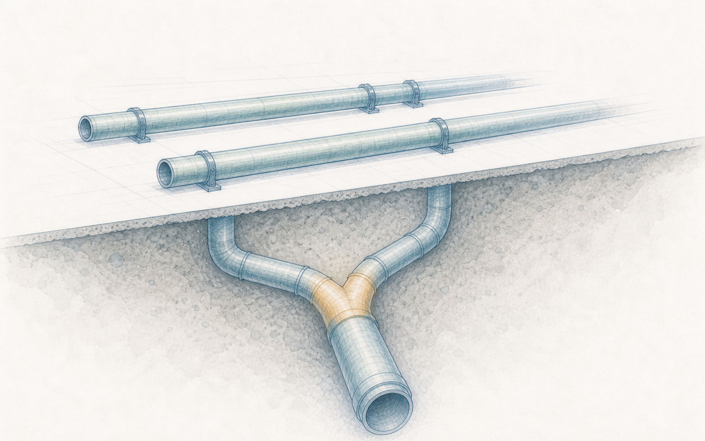
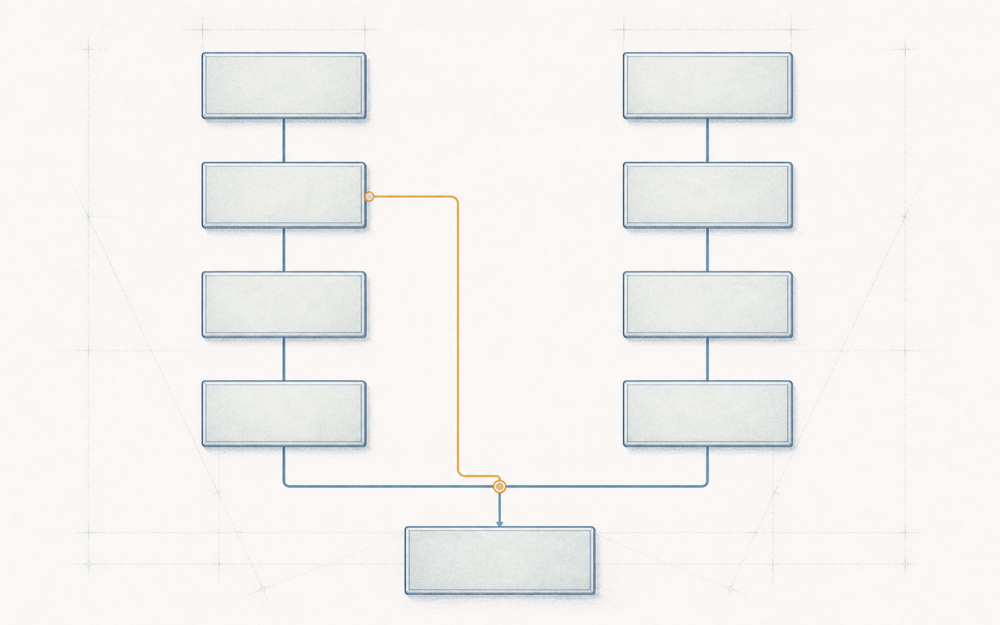

# 第 8 章 多一条通道，不等于多一分独立：ASIL 分解与相关失效分析

> Semantica 绑定： 本章保存 ASIL 分解、DFA 与独立性论证；唯一机器语义是
> `semantica.chapter_packages.vol2.ch08`，主场景为
> `semantica.vol2.ch08.scenario.primary`。方案本体、CQ、查询、Shape、案例、规则、
> oracle、manifest 与 receipt 全在 Semantica。当前为 `partial`、release
> `blocked`；未建模或不受支持的依赖推理不得被解释成“已证明独立”。

> **【导读】**
> 上一章散会时，一个问题挂在半空：软件达标了，硬件也达标了，可它们跑在同一块芯片上，
> 喝同一路电，听同一个时钟——各自合格，合在一起就安全吗？本章从一个最诱人的答案开始：
> 多画一条通道。冗余是工程最古老的智慧，分解也是标准明文允许的做法，
> 但“两路了就独立了”这句话里藏着两个没有兑付的承诺。本章先陪你把分解这份合同逐条读完——
> 拆出去的每条要求欠什么、原来的等级靠什么赎回；再听一位付过学费的供应商工程师讲，
> 两条画得漂漂亮亮的通道怎样共享同一个命运；然后跟着一场相关失效分析的走查，
> 看“独立”两个字怎样从一句口号变成一句可以被反驳的结论。
> 读完本章，你应当能对任何一张画着两条通道的架构图问出：这两条路在哪里共享同一个命运；
> 并且在“独立”写进结论之前，先说出它的分母——查过哪里、凭什么排除、剩下的谁来看住。

## 8.1 散会时挂着的问题，和图上多出来的第二条通道

软件的绿灯和硬件的绿灯各自立住之后，那个问题没有跟着散会一起散掉：
两套各自合格的东西，共享同一块芯片、同一路电源、同一个时钟——合在一起，安全吗？

周四下午的架构评审会就是为它开的。陈工主持，硬件负责人吴工带着原理图，
小林带着软件架构，小蔡负责记录。系统层需求评审来过的那家转矩传感器供应商，
这次又派来了系统工程师梁工——他们围绕自家传感信号，
给 EPS 的下一版监控链路准备了一套双通道方案的草图。

小唐第一个走到白板前。他画了两个并排的框，一条主通道，一条监控通道，
然后把笔帽合上：“其实答案已经在图上了。我们把监控功能单独拎出来，
给它画一条自己的通道——自己的输入、自己的判断、自己的关断出口。
两条路互为备份，一条倒了另一条还在，这就是独立。而且按分解的规矩，
一条最高等级的安全要求落到两条独立的通道上，每条通道自己的等级就可以降下来。
一张图解决两个难题：共享的担心没有了，因为有了第二条路；
等级的重担也轻了，因为拆开了。”

这段话一点都不外行。冗余是工程最古老的智慧之一：客机装两台发动机，
刹车分两条回路，医院配备用发电机——“别把所有鸡蛋放在一个篮子里”这句老话，
养活了半部可靠性工程史。分解也不是小唐的发明：功能安全的规则里明明白白写着，
一条高等级的要求可以拆到两个足够独立的部分上，各自按较低的等级开发。
方向没有错。错的风险藏在那两个“就”字里——“两条路了**就**独立了”，
“拆开了等级**就**降下来了”。

陈工盯着那两个框看了一会儿，问了一个很短的问题：“降下来——凭什么？”

会议室安静下来。是啊，标准允许拆，可它为什么允许？它拿什么换的？
在回答“两条路是不是真的独立”之前，得先弄清一件更基本的事：
分解这份合同，到底许诺了什么，又向我们要什么。

## 8.2 拆开的是承诺，不是工作量

先替小唐把最顺手的理解摆出来：分解是一种加法。D 级拆成 C 加 A，
就像十块钱换成七块加三块，总额守恒，各自的担子轻了。
这个理解必须第一个排除，因为它错得最隐蔽：安全等级不是数值，是刻度——
它标注的是开发和验证要多严谨，不是一种可以存取的额度。
两笔低额存款凑不出一笔高额信用；C 加 A 不是 D 的算式，
它是标准点过头的几种冗余结构之一。以最高的 D 级为例，
允许的拆法是一高一低（C 加 A）、两个居中（B 加 B），
或者一条保持原级、另一条按常规质量管理开发——每一种都是结构，不是分账。
这个错法隐蔽到什么程度？查表居然查得通：把五档从低到高数成零到四，
一高一低是三加一，两个居中是二加二，原级加常规是四加零——允许的拆法
个个“加起来等于四”。可这份整齐是挑出来的，不是算出来的；它最坏的作用
是教人把刻度当额度，仿佛账面已经配平，后面那笔最贵的独立性证明就可以不付。

第二个顺手的理解是：我们已经有两路了。软件架构里本来就有主算法和监控模块，
一个算助力，一个查合理性，各管一摊——把这两个模块画成两个框，不就是分解吗？
这个理解也要排除，而检验它只需要一个思想实验：**把另一条路遮住。**
遮住主算法，只剩监控模块——它靠什么输入发现“助力不该来的时候来了”？
它有没有自己的关断出口，还是只能给主算法发一条“请你停下”的消息，
而主算法此刻已经失效？分工回答的是“谁做哪一部分”，
分解要求的是“每一条拆出去的要求，独自就能兑现原来那句承诺”。
一只只会看“程序还活着没有”的简单看门狗，发现不了“程序活着但一直在算错”——
把它算作第二条通道，遮住试验一遮就穿帮。协作不是冗余，两个框不是两条路。

把这两种理解排除之后，分解合同的真实条款才能读清楚。它有两页。

第一页是**功能的页**：拆出去的两条要求，每一条都必须自己扛得起原来那句话。
对 EPS，那句话是“在危害容许的时间窗口内发现非预期助力，并把系统带进受控的降级”。
主通道单独在场时要能做到，监控通道单独在场时也要能做到——各自的输入、
各自的判据、各自可达的关断出口、各自算得清的时间账。两条路可以用不同的原理，
但不许互相借答案：“监控器会替我兜底”不能写进主通道自己的理由里。

第二页是**信用的页**：原来那个高等级的风险降低，不由任何一条路单独提供，
而由两条路的组合、加上一件必须另行证明的东西——独立——共同赎回。
所以每条拆出的要求都带着一个括号记号：拆出来的 A 写作 A(D)，
括号里的 D 是一笔来源记忆，提醒所有后来的人：这不是一条普通的 A 级要求，
它在一条最高等级的承诺链上服役，它的“低”是用独立性押出来的。

小林在这时问了一个很实际的问题：“那软件这边是不是可以松口气？
拆完以后监控通道按低等级做，测试和评审都能省不少吧。”

省，但不是全省——有几笔账不打折。两条路各自的开发可以按拆后的等级配置，
这是分解真正让出的地方；可是把两条路合起来、验证它们共同满足原来那条要求的集成工作，
按拆之前的等级走；面向原安全目标的整体硬件账（上一章那些失效率指标）不因为拆了就分成
两笔小账各自过关；而支撑这一切的独立性分析本身，恰恰要按原来的最高等级来做。
换句话说，分解把担子从“两条路各自”那里挪走了一部分，
又把它加到了“两条路之间”——省下的钱，要拿去买独立的证明。

**分解拆开的是承诺，不是工作量：每一条拆出去的要求都必须独自扛得起原来那句话，而原来那个等级的信用，要靠两条路的组合加上被证明的独立才能赎回。**

合同读完，小唐的方案还剩最后一个词没有着落，也是最贵的一个词：独立。
图上分开的两条路，命运也分开了吗？

## 8.3 两条通道，一个命运

小唐转向梁工：“你们这套双通道方案，独立性应该有现成的报告吧？”

梁工没有直接回答。他说：“我先讲一个我们自己的项目。”

几年前，梁工所在的团队给另一家客户做过一版双通道的转矩监控设计。
两条通道分属两颗处理器，各自的需求、各自的代码、各自的测试，
两边的通道级验证全绿，报告写着“互为冗余，彼此独立”。
B 样的电路板已经投了板，试验夹具做了，认证排期订了。
然后客户的安全负责人来做联合走查，第一个问题是：“把电源树给我看一下。”
沿着供电往上追，两颗处理器的电源最终汇在同一颗稳压器上；更难看的是，
那颗稳压器的使能脚，接在主通道处理器的一个输出上。这一笔在原理图定稿时
还是个加分项：上电瞬间两路一起启动容易把电源拉趴下，让主处理器先起来、
自检看到电压站稳，再抬这个脚放监控通道上电——上电顺序管得干干净净。
没有人在任何一次会上决定过“让主通道掌管监控通道的生死”，这句话是从那个
完全合理的局部决定里自己长出来的：主通道的某几种失效，会顺手把监控通道
的电也拉掉。走查继续，第二个发现跟着来了：
两条通道的输入滤波，用的是同一份代码库里的同一个函数，
同一个边界条件缺陷，两边各复制了一份。

“结果是重新布板，两百多块样板报废，认证试验全部重排，项目推迟了两个多月，
定点差点丢掉。”梁工说，“客户当面问我：你们的独立性报告里，怎么没有电源树？
我记得我的回答是——我们每条通道都测过。”

会议室里没有人笑。这句话和郑工那句“通过的是样机”，是同一个句式。

顺带把两个数字掂一掂，它们互相作证。两百多块不是挥霍：一次 B 样投产，
台架要板、耐久要板、认证要板、整车试制要板，再加夹具调试和备件，本来
就按这个盘子备料——报废也就按这个盘子报废。两个多月同样拆得开：改板
画图一两周，新板打样贴装三四周，两条通道的验证重跑两三周，让出去的认证
台位重新排队还要再等——前几段只能串着走，首尾一接，两个多月已经是一切
顺利的结果。

这个故事最扎人的地方在于：它不是粗心的产物。两边的设计都认真，
两边的测试都真实，报告没有一个字造假——每条通道**各自**的一切都对，
错的是“各自”这个视角本身。功能安全给这类失效起了一个准确的名字：
**相关失效**——两条路的失效不相互独立。它有两种典型的走法。
一种叫**共因失效**：同一个原因，同时够到两条路。一次电源浪涌放倒两颗处理器；
同一份代码缺陷在两边各发作一次；同一批次器件带着同一个工艺弱点一起老化。
另一种叫**级联失效**：一条路的失效沿着某条现实存在的路径，把另一条路拖下水。
主通道错误的输出污染了监控通道的输入；低等级的任务占满了处理器，
高等级的监控没有了运行的时间。还有一种更安静的走法：监控通道先被某个共同的原因
悄悄放倒，几天后主通道再失效时，岗哨早已不在——两次失效不在同一瞬间，
合起来仍是同一个命运。

听到这里，自然的对策会一个个冒出来。把供电分开走线、把两颗芯片摆远一点？
有用，但那只是修改了嫌疑清单，没有出具结论——分开供电之后，
共享的传感器、共享的时钟源、共同的接口规格还在原地。那就用两颗不同型号的芯片、
两家供应商？也有用，但两条通道仍然可能读同一颗转矩传感器、
由同一份需求文档喂大、被同一个编译器编译、在产线上被同一台设备刷写。
反过来也一样：同住一颗芯片不等于自动判死刑——有些芯片内部有独立的电源岛、
独立的时钟和经过验证的隔离机制，判断的依据是对具体架构的分析，不是框图上的距离。

**图上的两条通道是几何事实，独立是工程主张；依赖不住在方框里，住在方框之间的缝里。**

梁工最后说：“所以你问我要现成的独立性报告——我没有。
我有的是一张清单，上面是我们那次学费换来的每一道缝。走查要一起做。”

那么，缝要从哪里系统地找？怎样把“独立”从一句口号，变成一句可以被反驳的话？

<!-- FIG:ch08-fig01-hidden-common-power:OBSERVE -->
> **读图任务**：先看上方两条功能通道为什么像是并行独立，再沿供电线向下追踪到同一上游模块，并注意额外的非对称控制线。

<!-- FIG:ch08-fig01-hidden-common-power:CONSUME -->
> **图后判断**：图中共享电源是一个反例结构，不代表任何真实架构。它不给出 ASIL 分解等级，也不证明共因故障已发生或已被缓解。

## 8.4 给“独立”一个分母

下一周，团队为候选的双通道架构做了第一次相关失效分析走查。
参加的人：陈工、小唐、小林、吴工、梁工，小蔡记录。

开场之前，先排除两种省事的做法。第一种：开个头脑风暴会，
大家把想得到的共因列一列，逐条讨论完就散会。问题在于没有分母——
“没想到”和“没有”在会议纪要里长得一模一样，三个月后没人分得清
哪些缝是查过并排除的，哪些是压根没人提起的。第二种：给共因估一个百分比，
乘进可靠性计算，让它变成一个“已经考虑过”的数字。这更危险：
需求被两边同样误解、同一份代码缺陷、同一个接口规格错误——这类系统性的原因
没有诚实的发生概率可言，给它编一个数，得到的是一个看起来精确的错误。

走查用的是另一种纪律：沿着“一个原因怎样同时够到两条路”，
把可能的耦合处一条一条过，每一条都必须得到三种回答之一——
找到了可信的嫌疑、查过了并有排除的理由、或者暂时回答不了。空白不算回答。

| 追问的缝 | 对 EPS 双通道的问法 |
|---|---|
| 供电 | 两路的电源向上追，最终汇在哪里？谁的失效能拉掉谁的电？ |
| 时钟与时间 | 两路各自凭什么知道“现在”？时间基共享吗？ |
| 输入与信号 | 两路的判断吃的是不是同一颗传感器、同一个适配层？ |
| 代码与规格 | 两边有没有同一份库、同一份接口文档、同一个编译器的影子？ |
| 工具与批次 | 谁给两路刷写？器件是不是同一批次？ |
| 环境与位置 | 同一处发热、同一次振动、同一个连接器，会不会一次够到两路？ |

这张桌子上，那天下午立了三桩案子。第一桩由小林自己举手：
两条通道的转矩样本都经过同一个信号适配层，而软件那边最近暴露过一个毛病——
适配层把“到达的时刻”盖在样本上当作“采样的时刻”。一条在队列里滞留的旧样本，
两条通道会同时把它判成新鲜的。功能上再不同的两套判断，
喝的是同一口被污染的井水。第二桩由吴工画出来：两路的供电各有稳压，
但向上追两级，汇在同一个上游——一次足够深的电压跌落，
可能先放倒监控、再放倒主路，前后脚，不需要同一瞬间。第三桩由梁工提出：
按现在的产线设想，两条通道由同一台刷写设备、同一份配置源写入——
一次错误的配置，可以在下线那一刻同时写坏两路。

要紧的是接下来怎么处置。立案不是判决：每一桩都要继续回答——这个原因可信吗，
真发生时两条路是否都会在时间窗口内失守，用什么措施看住它，措施又被什么证据验证。
措施有三条路可走：断掉根源（把采样时刻在源头写死，传输途中不许覆盖）、
挡住影响（两路各自用自己可信的时间基核对样本年龄）、拆开耦合（给监控通道
一个独立的时间来源）。而措施定了不算完——郑工的台架为此排进了两项新试验：
供电跌落和报文乱序，逐路观察系统是否仍在窗口内转入安全反应。
关掉时间戳这一桩，供电那桩不会跟着关；每一桩各有各的证据、各有各的负责人。

走查也不是从零开始的。它有两个上游供线索：故障树分析从顶事件往下拆——
“两条路同时漏检”这个顶事件本该是一个“与”门，两条腿都断才塌；
可如果“共享的旧样本”这同一个基础事件出现在两条腿底下，
冗余在树上当场退化成单点，树把重复照了出来。失效模式与影响分析从底下往上推——
逐个元件问“你坏了会怎样”，当同一类失效模式在两条通道里反复出现，嫌疑就该上桌。
但两者只负责生成嫌疑：树上的重复事件、表里的相似模式，可不可信、
在这版架构里是否真有那条路径，要由走查对着原理图和代码一条条判。
分析是接力，不是替身。

散会前小蔡问了她的问题：“上个月软件那边不是出过一份‘互不干扰’的分析吗？
高等级和低等级的任务住同一颗芯片，证明低的不抢时间、不越内存、不堵通信。
拿它当独立性证据，行不行？”

不行，但这个问题问得好，因为它逼出了一条容易踩的边界。同住一个元素里的高低等级部分，
默认要全部按最高等级开发；想让低等级的部分维持低等级，就得证明它不给高等级的邻居添乱——
不抢它的时间、不碰它的内存、不堵它的通信。这是**共存**的证明，回答的是
“同屋的人别惹事”。而分解要的是“两条路各自成事，并且不同命”——
共存是其中很窄的一小块，它管不到两路共享的供电、传感器和代码谱系。
把共存报告当独立性证据，就是拿一间屋子的门锁，冒充两栋房子的地基。

走查的记录最后长成这样一句话的形状：在声明的架构版本和运行模式内，
沿着这些缝逐条查过；这几条有可信的嫌疑，各由某项措施看住，措施经某项试验验证；
这几条凭这些理由排除；这几条还没有答案，开着。它不好看，但它可以被反驳——
任何人都能指着某一条问：你凭什么排除？你的措施验证了吗？还有一条为什么还开着？

**“独立”不是“没发现问题”，而是一句有分母的结论：查过哪里、凭什么排除、剩下的原因由谁看住、看住的证据在哪里。**

这套问法立住了。但它是转向系统专属的吗？出了这间会议室，还成立吗？

## 8.5 换一个世界：ENV-01 的两只探头

那台工业环境监测单元 ENV-01 的团队，为了“更可靠”，给关键测点装了两只同型探头，
读数取平均，互相校验，任何一只失效都能被另一只发现——听起来是不是很熟悉？

用同一套问法追下去：两只探头是同一个批次；出厂时对着同一台参考仪器校准，
校准系数存在同一份配置文件里；固件里跑的是同一个滤波算法；供电来自同一块板子。
如果参考仪器那天偏了，两只探头带着同一个偏差出厂，取平均只会把这个偏差
算得更“稳定”；如果滤波算法在某种阶跃下都失真，互相校验永远一致——一致地错。
两只探头，平均的是两份同一个错误。

可迁移的仍然只是问法——“这两条路在哪里共享同一个命运”。答案不许迁移：
ENV-01 的缝要在它自己的架构里找，它的措施要用它自己的试验来验证。
问法能走出行业。但还有一个更近的问题：那份走查记录本身，能走过时间吗——
三个月后，它还活着吗？

## 8.6 纸面查不动的缝

必须先说公道话：走到这一步，已经是 AI 之前的世界里最好的做法了。
分解合同两页都读了，等级的括号记着来源，走查有清单、有分母、有开着的案子——
几十年里，这套纪律拦下过无数个“两路了就独立了”。第 1 章那张地图上，
“多一条通道为何不等于独立”这个断面，纸面的答案就到这里，而且答得相当体面。

但只要把时间拉长，就能看见三道纸面查不动的缝。

**清单的完整性押在伤疤上。**那天下午最有价值的三个问题，一个来自小林刚踩过的坑，
一个来自吴工手上的原理图，一个来自梁工两百多块报废样板换来的记忆。
换一个没有伤疤的团队，同一张图，走查会短一半——而纪要上同样写着“已完成走查”。
清单可以印成模板，“哪里算查够了”却没有底：缝不会自己报名，
它等着一个恰好付过那笔学费的人路过。专家的记忆是这套做法真正的数据库，
而记忆不可移交、不可盘点、会退休。

**架构图不画共享。**图纸的天性是画部件和连线：两个框、两条走线，清清楚楚。
可那天立案的三桩，没有一桩是图上的一条线——“同一份代码库”“同一个适配层”
“同一台刷写设备”“同一批次器件”，全都不是几何对象。最危险的耦合，
恰恰都画不出来。于是评审看图，图上永远是两条路；依赖住在图外，
住在代码仓库、采购记录和产线工艺文件里，没有任何一张视图把它们摆到同一双眼睛前。

**排除理由不跟着版本活。**走查记录里写着：“两路使用不同传感器，共享输入一项排除。”
这句话为真，押在“不同传感器”这个事实上。三个月后原理图改版，
为了降成本把两路合到同一颗传感器上——那行排除理由不会自己失效，
纪要不会弹出警告，走查报告安安静静躺在文档库里，结论还是“独立”。
纸面上，结论和它押着的事实之间没有任何活的连接；事实变了，只能靠又一个人
恰好记得当年那行字。走查可以再开一次，但“哪些结论需要重开”这个问题本身，
纸面回答不了。

**走查记录写在纸上，依赖活在版本里：事实变了，纸不会自己举手——这是纸面独立性的边界。**

所以本章末尾冻结的，是三个只能留给后十章的问题：给定一版架构和它背后的
全部共享事实——器件、代码、工具、批次——能不能让机器回答“这两个元素之间
存在哪些耦合路径”；给定一条排除理由，能不能问出它押在哪些事实上、
其中哪一个已经变了；给定一份走查记录，能不能随时查出哪些案子还开着、
谁在看守。第 18 章会从这三个问题出发，把依赖与独立做成机器可以检查的结构——
那是 AI 之后的世界的做法。

而眼前，还有一桩立了案却还没找到主场的事。那天走查的第三桩——
同一台刷写设备、同一份配置源写两路——它的战场根本不在分析室，在工厂。
分析里的独立性成立了，靠的是一整套边界：不同的供电、不同的批次、
不同的配置来源、独立的时间基。可这些边界是分析的语言，图纸移交工厂之后，
产线认识它们吗？换一颗“等效”的代换料，会不会把两路换成同一批次？
维修站换件重刷，会不会用同一份配置把两条通道一起写错？
设计在分析里挣来的每一分独立，制造和服务的每一个环节都有机会在无意间还回去。
第 9 章就从这里开始：设计的含义走进工厂之后，还能不能连续。

导读的承诺可以兑现了。合上书之前，做三件事：找一张你项目里画着两条通道的图，
沿供电、时钟、输入、代码、工具五条缝各追一次，数数有几条最终汇在同一点；
找一份写着“独立”或“互为备份”的结论，问出它的分母——查过哪里、凭什么排除；
再挑其中一条排除理由，把它押着的事实写下来，问一句：这个事实要是变了，
今天谁会知道？如果答案是“没有人”——记住这个位置，第 18 章会回到这里。

---

> **本章注记**：本章的评审场景、走查过程、人物与全部产品细节（双通道方案、
> 供应商往事中的电源树与代码库缺陷、样板报废数量与延期时长、ENV-01 的探头配置等）
> 均为合成教学材料，不对应任何真实企业、真实产品或真实个人。正文对功能安全标准中
> ASIL 分解、元素共存与相关失效分析要求的转述为自然语言概括，精确要求以标准原文为准；
> 文中的允许组合与分析方法描述不构成对任何实际项目的裁决，也不表示任何架构
> 已获得独立性结论或任何产品已获放行。
