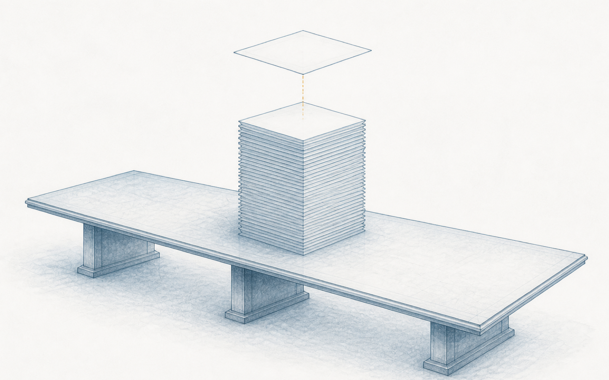
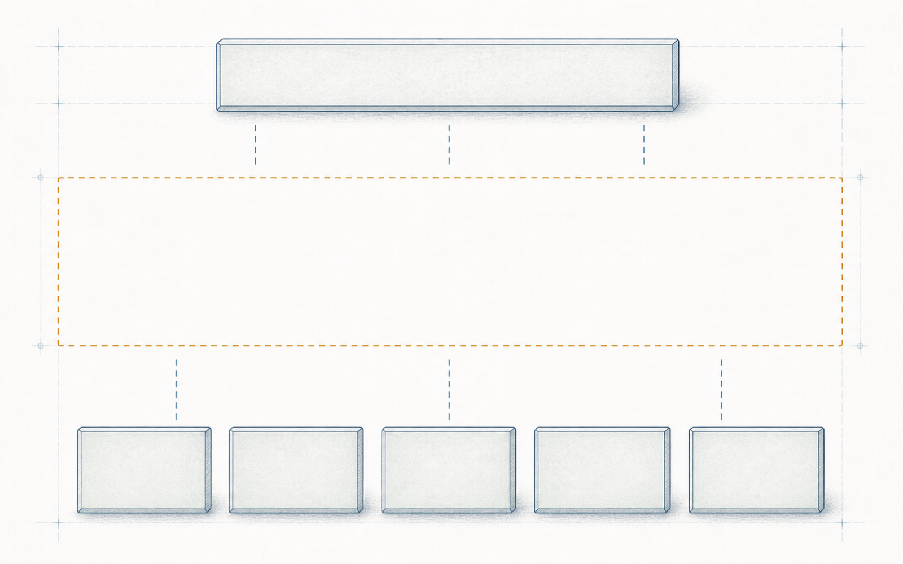

# 第 10 章 回到放行桌：支撑过程与安全案例

> Semantica 绑定： 本章保存工具、配置、文档、安全案例与放行边界的可读规范；
> 唯一机器语义是 `semantica.chapter_packages.vol2.ch10`，主场景为
> `semantica.vol2.ch10.scenario.primary`。本体、CQ、查询、Shape、案例、规则、oracle、
> manifest 与 receipt 均在 Semantica。当前为 `partial`、release `blocked`；
> 多个局部 PASS 不会自动合成为一次有权放行。

> **【导读】**
> 六周之后，第 1 章那间会议室重新亮灯：还是候选 RC17，还是那六张绿卡，只是桌上
> 多出三箱这些日子攒下的新证据，而围坐的人已经换了一副语言。本章是前半部书的收口：
> 陪这支团队把一摞文件整理成一份主张—论证—证据三层的安全案例，走到纸面世界能达到的
> 最好状态；顺便把一直躲在幕后的手艺请到台前——接口协议、配置、变更、文档、工具
> 与复用，它们不产生任何一页证据，却决定证据还连不连得上。最后，我们会诚实地承认
> 这份纸面案例到不了的三个地方，并把前十章的账一次冻结。
> 读完本章，你应当能把一堆各自为政的“通过”报告整理成一份能被反驳的安全案例，
> 并说出纸面案例的三个极限。

## 10.1 三百多份文件，合在一起说的是哪句话

会议室的门再次推开时，最先进来的是一辆推车。从设计到现场，每一环都有了自己的证据，
现在它们被物理地搬回了放行桌：概念、系统、硬件、软件、走查、生产与现场，
这几周各个专业交来的产出，小蔡按专业和日期分好了类，装了三个文件箱，三百多份。

“上次评审缺的，这回都补上了。”她说，“比上次厚了三倍。我照标准的目录做了一张清单，
每一项都能对上号。装订好交上去，应该就齐了吧？”

这句话不外行。很多公司的放行包正是这样交付的：按标准章节立目录，逐项打勾，
审核来了按目录抽查。文件在、格式对、签名全，是每一次审核都真实检查的东西，
小蔡把这件事做到了无可挑剔。

陈工翻了翻最上面那一箱，问了一个问题：“这三百多份文件，合在一起，说的是哪一句话？”

没有人答得上来。每份文件各自说了一小句——这版硬件的失效率有来源，这组用例在那套
配置上通过，这条产线的写入有校验和——可是“RC17 可以放行”这句大话，哪一页都没有说，
也没有哪一页有资格说。三百句小话堆在一起，还是没有那句大话。

有人提议在清单上再进一步：给每份文件标注它支撑标准的哪一部分，凑齐了就算完整。
这个方案的毛病上一次评审已经领教过——清单证明文件“在”，证明不了文件“支持”；
目录齐全的档案馆里，照样可以一句结论都没有。又有人提议请一位资深评审人通读全部
材料，写一篇总评，让总评替大家说那句大话。这个方案更诚实，却把整个问题塞进了
一个人的脑子：总评是又一份文件，它的判断没有结构，别人想反驳都无处着力——
反驳它，难道去反驳“我读完了，我觉得行”吗？

两条路都堵住，缺的东西才露出形状。这个行业早就给它起了名字：安全案例——
一份针对具体对象、论证安全已经达成的文书。它不是文件的总和，而是一场写在纸上的
辩护：最上面是一句写清了部件的主张，最下面是各自射程有限的证据，中间是一层论证，
写明这些证据为什么、在什么条件下，合起来足以支撑那句主张。法庭不认一麻袋证词，
法庭认的是起诉书、辩护词和证据链各就各位。

**一摞文件是档案，不是案例；安全案例是一场写在纸上的辩护——主张在上，证据在下，中间的论证没人写，上下两层就只能隔空相望。**

而主张这一层，其实已经有人写好了。陈工从自己的文件夹里抽出几页纸，推到桌子中央——
小唐的主张部件清单，六周前散会时布置的作业：主语、配置、关注、情境与时间、假设、
决定范围，一个部件一格，第一行填的就是 RC17 和它的五项配置。“骨架用它。”陈工说，
“上次想签字的人，把能签的话拆开又装了回去。今天我们把肉挂上去。”

骨架立起来了，可肉不是新的——还是那六张绿卡，加上这几周的补测和分析。
它们还认得这六周学会的语言吗？一张一张挂上去，会挂成什么样子？

## 10.2 六张绿卡，重新开口

挂卡用了两个下午。同样六张卡，每一张开口说的话都和六周前不一样了。

概念边界卡先上。它不再笼统地说“分析通过”，而是先报自己的座位——对象是候选相关项
的边界，不是哪块控制器、哪个构建——再报自己的担心：几种失常行为在选定场景下的
伤害风险，每个风险后面跟着一句安全目标。它挂在主张的“关注”一格下面，作证的是
“担心已被点名”，不是“担心已被消除”；这两句话之间隔着后面所有的卡。

硬件分析卡跟上。吴工那边交来的失效率数字，这一次每个都带着宿主、方法和来源：
哪颗料、出自哪本手册还是哪批实测、按什么任务剖面折算、不确定度多大。数字有了射程，
它支持的小句才写得出来：在声明的剖面与假设内，这版控制器的随机失效风险落在目标
之内。假设清单单独成页，挂在主张的“假设”一格——那些被“先信了”的东西，
信到什么时候、由谁去验，都写着名字。

软件回归卡由小林重新交上。对象一栏钉死在 SW1.8.3 加 C41；旁边多了一页变更登记：
1.8.4 的升版申请仍然在途，他的差异分析圈出了受击的模块与用例范围——申请一旦获准，
哪些结论重开、哪些凭明确理由保留，答案提前写好了。一次通过不再默认穿越版本，
这是他这些日子学得最贵的一课。

台架卡最引人注目。郑工交了两样东西：一份差异说明，把 P07、预览构建、C42 与目标
快照的每项偏差写明，声明这张旧卡支持的是另一句主张，只作旁证；一份定向补测，
用目标配置把当初的边界工况重跑了一遍，这才是挂进案例的正证。然后他从抽屉里拿出
那页压了许久的异常读数，放进案例的第一部分：“错误候选，在链上还没走到失效；
补测未复现，传播和容错都没证据，当前为未知。列开放项，我看守，复现即重开。”
他顿了顿，“这一页，我不想再放回抽屉了。”

冲击振动卡照旧支持局部样件的可靠性小句，射程原样声明。走查那几周揪出的那路共享
供电——两条监控通道曾经共用一路电，图纸上看着独立——作为反证挂在论证下面，
旁边是整改记录和复测结果：反证没有被删掉，它被处置了。生产写入卡由老何补齐了
批次一栏：镜像、校验和、工位、批次，设计定义到产线记录的那条身份链，一环一环
能指认到具体的东西。

到这里，有人提议让每个专业把自己的卡再加厚一轮，附上全部原始数据，显得更扎实。
没有必要——页数不是论证，法庭不按证词的斤两断案。又有人提议省事些：每个专业在
卡末自己添一句“因此支持 RC17 放行”。这一句谁都不能写——那是让证人替法官宣判，
每张卡的射程都够不着那句大话，六个“因此”加起来还是够不着，第 1 章的旧病不能
换个写法再犯一遍。

那句大话只能由中间那层来扛。论证这一层，是团队第一次真正合写的东西：从每条安全
目标出发，沿着派生的理由链，把系统需求、软硬件需求和它们各自的验证一条条接起来，
派生的理由写在明处；每个环节标明谁执行、谁复核、谁有权接受，方工带着他的独立评估
从旁挑战——评估的人和拿主意的人分开坐，这是第 3 章付过学费才分开的两把椅子；
关注只并列、不折算，安全的小句和可靠性的小句各归各的分支，谁也不给谁凑总分；
缺口不藏，逐条声明：异常读数未知待判，升版申请在途，低温工况的覆盖靠新补的台架
而不再靠沉默。

**论证是案例里唯一不能由任何单个专业交出的东西：它写明这些射程有限的证据为什么合起来够了，也写明哪里还不够、由谁看守、何时重开。**

两个下午收工，骨架挂满，第一次像了回事。可小蔡整理引用清单时发现，这份案例引用的
证据来自四个专业、两家单位、七八套工具和三个记录系统。把它们连在骨架上的那些线——
谁交给谁、哪版对哪版、改了怎么办、报告是谁生成的——由谁看守？

<!-- FIG:ch10-fig01-argument-gap:OBSERVE -->
> **读图任务**：先分别看顶部主张和底部证据卡，再把注意力放在中间的大面积空缺，检查虚线是否真的说明了两者之间的支持关系。

<!-- FIG:ch10-fig01-argument-gap:CONSUME -->
> **图后判断**：本图只揭示结构性缺口，不判定底部证据的真伪或充分性，也不因将证据放入案卷就自动产生产品级授权。

## 10.3 看不见的线：六种支撑手艺

第一反应是最自然的那个：各家看好自家的线。软件管软件的版本，硬件管硬件的表格，
供应商的证据由供应商自己保管。这正是大多数团队的现状，它的断点也早被大家踩过：
线断的地方从来不在各家院子里，而在院墙上——供应商交来的传感器数据算谁复核过，
台架的配置该对谁的表，一到边界，“自家看好”这四个字就没了主语。

第二反应是买一套大系统，把所有证据集中进库，统一编号、统一权限。集中确实解决了
“找不到”，但库统一的是存放，不是含义：两份编号规整的报告，照样可以一份说的是
这版软件、一份说的是那版。而且系统和它的管理员自己成了新问题——小蔡在第 2 章
问过的那句“改台账谁批准”，在这里原样复活。

这个行业给出的答案不是一件工具，而是一组手艺。它们在标准里占了整整一部分，
名字都不响亮，做的事却是同一件：看守证据之间的关系。

接口协议看守组织之间的线：哪些活动谁做、哪些信息怎么交、谁有权到对方现场去看，
写成双方签署的约定，证据跨过公司边界时才带得动它的责任和射程。配置管理看守版本
之间的线：给一组相互匹配的版本一个共同身份——基线——每份证据声明自己绑在哪条
基线上，“同一个 RC17”才从口头默契变成可核对的账。变更管理看守时间上的线：
从申请、影响分析、有权者的决定，到实施、验证、记录，一环不许跳——小林那页差异
分析，就是这条链上“影响分析”的正身，而不是可有可无的附件。文档管理看守每一页
自己的身份：标题、作者、批准人、版本、状态，新版不覆盖旧版，旧报告永远还能作
它当年那句证。复用看守旧证据的线：那颗用了十年的老料、那段跑了三代产品的底层库，
“用了十年”只是故事的开头——同一版本吗？同一用法吗？这十年里它和它周围的变化
记在哪？回答不出，年头就折不成信用。

还有第六种，最容易被忘掉。讨论到打包流程时，小林说了一句：“至少工具这块不用操心。
回归是流水线跑的，报告是脚本生成的，机器不会手抖。”

这句话不外行，甚至就是自动化的初衷：让机器做搬运和誊写，恰恰是为了消灭人手抖
出来的错，而流水线也确实从没在誊写上错过。但方工接了一个问题：“如果脚本自己
错了呢——谁会发现？”会议室安静下来。检查产品的工具，自己也是一个会出错的产品；
它的输出有没有人再看一眼，决定了它错的时候是被拦住，还是长驱直入。这个行业连
这件事都做成了分级的问法：这件工具错了，会不会把错误引进产品、或者放过本该
拦住的错误？真错了，现有流程有多大把握发现？两问的答案合起来，先给这件工具
定一个“多不放心”的档——行话把这个档叫工具置信度（TCL）——定在哪一档，
才决定它需要为自己攒多少证据。小林的流水线跑了两年，
从没有人对它问过这两问。

**支撑过程不产生一页产品证据；它们看守的是证据之间的关系——关系一断，每一页都还是真的，合起来却开始撒谎。**

纪律逐条补上，案例定了稿，放行会定在周四。这份案例，现在是不是终于无懈可击了？

## 10.4 会前一晚，十一点四十

周三夜里十一点四十，小蔡还在核最后一遍引用清单。她给自己立了个笨规矩：
每份报告的“哪版配置”一行，逐份抄出来对一遍——这个规矩是从第 1 章那张软件
射程卡上学来的。抄到软件回归报告时，笔停住了：封面写着 RC17，配置行却写着
SW1.8.4 的预览构建。

打了三个电话才弄清楚。小林的团队为差异分析做过一轮预演，在 1.8.4 的预览工作区里
重跑了部分用例，报告模板照常生成了一份新修订；打包脚本的规则是“取最新修订”，
于是放行包里那份回归报告，被悄悄换成了预演版。“取最新修订”不是谁的懒惰。
脚本写下这条规则的那几年，全组只有一条开发线，报告一版盖一版，
新修订永远是旧修订的更正，“取最新”就等于“取最对”——在只有一条基线的
世界里，这是个完全正确的默认。预览工作区开出来的那天，世界悄悄变成了
两条线，可两条线生成的报告落在同一个目录里，脚本按时间一排，
谁最后落盘谁就是“最新”。规则一个字没改，规则底下押着的那个前提没了——
而没有任何一个岗位，负责在前提变化的时候去通知一条脚本规则。
包里其余文件都绑着 SW1.8.3——
两份报告，两条基线，同一个封面日期。每一页都是真的，包合起来在撒谎。
而这个包，已经作为定稿发给了全体与会人。

夜里的第一反应是最省事的：把文件换回来、封面改一改，天亮前没人知道。被小林自己
按住了——改封面不是改事实，那份预演报告的正文说的就是另一版软件，改了标签，
谎只是换了件体面的外衣。第二反应是推迟评审，把三百多份文件全部人肉重查一遍。
查，当然要查；但全查解决不了问题本身——这次查完了，下次呢？每次放行都要靠全员
通宵对表的流程，不是流程，是赌运气的仪式。

正确的动作没有捷径：撤下错版，追回定稿，取回绑定 SW1.8.3 的那份正身；打包脚本
连夜加了一条规则——按基线取件，不按“最新”取件；事故本身写进案例，作为一条
已处置的反证留档。代价照单全付：周四的会推迟到下周一，本就顺延过一次的决定窗口
又被咬掉一块；小林团队搭进去一个周末，逐份重对引用；客户那边的搭载联络会跟着改期。
散会后小林在走廊里说了一句话，后来进了组里的培训材料：“报告是我的组生成的，
错也是我的组生成的。机器没手抖，是我们没对它问过那两问。”

下周一的放行会，反而是六周以来最短的一次。案例摊在桌上：小唐的部件清单是第一页，
六张卡和补测证据各就各位，论证层写明理由，开放项逐条带着看守人，重开条件写了
三条——异常读数复现即重开，1.8.4 获准实施即重开，窗口到期即重开。方工宣读独立
评估的结论：建议接受，附条件。陈工逐页翻完，问了最后一轮问题，然后在那句长长的
主张下面签了名——不是“EPS 可以交付了”，而是：针对 RC17 这个快照，在声明的关注、
情境、假设、缺口与本轮窗口内，现有证据足以支持本轮放行决定，接受，附重开条件。

签完字，陈工把笔搁下，看了一眼郑工。当年冬试事故的复盘会上，有人问过郑工
“你的台架不是通过了吗”；今天的案例里，台架那张卡终于只作它够得着的证，
差异写在明处，异常读数摆在第一部分，重开条件里有它的名字。郑工什么也没说，
只是把开放项那一页又抚平了一遍。

小唐看着那句他亲手拆开、又亲手装回去的话，也没有说话。六周前他觉得签字是
一瞬间的事，现在他知道，那是一整套结构压上来的重量。白板中央，六周前写下的
“EPS”还没擦，陈工在旁边补了一行小字：RC17，已接受，附条件。

**能签的从来不是“产品可信”，而是一句带射程、带缺口、带重开条件的接受——这句话，纸面世界今天做到了。**

散会时没有人鼓掌。走出会议室的人心里都清楚，这已经是纸面能到的最好状态——
可周三那个深夜也同样清楚地提醒过他们别的事。纸面到不了的地方，究竟有几处、在哪里？

## 10.5 纸面的极限，与一扇门

先试着不认账。有人提议给打包加一道流程：双人复核，两人签字。有用，但它是在给
“人会疏忽”这个问题增加更多的人——周三夜里那处错，靠的是小蔡的笨规矩加上运气，
双人复核执行到第两百次时的疲劳，和单人没有本质区别。又有人提议把本章全部纪律
做成一张总检查单，每次放行走一遍。也有用，但检查单查得出“字段在”，查不出
“两份报告说的是不是同一个东西”——它能问“配置行填了吗”，不能替你把三百多份文件
的配置行互相对一遍。两个方案都是往纸上再加纸，而病根恰恰长在纸的性质里。

把那个深夜的教训放大，纸面案例到不了的地方一共三个。

第一，证据包没有办法自己核对同一基线。三百多份文件是否都在说同一个快照，
纸面上唯一的核对手段是人眼逐行对表。小蔡对出来了，是她的纪律，也是运气；
没有任何机制保证下一个深夜也有人恰好停笔。

第二，变更的影响靠人工圈定。小林的差异分析是这份案例里最专业的几页，可它的每一条
“受击”与“不受击”，都出自他对这套系统的私人记忆。下一次升版，还得是他；
他要是像郑工当年那位前任一样调岗离开，这份手艺不会随文档留下来。

第三，安全案例是死文档，产品是活的。签字那一刻，案例是真的；从下一刻起，
产线在写入新的批次，现场在传回新的工况，1.8.4 在路上，而案例躺在库里一动不动。
它不会因为世界变了而举手，只能等下一次有人想起来重开它——重开条件写得再好，
也得有人来读。

回头看，前面每一章冻结的问题，其实都是这同一道裂缝：职责与签名链的闭合靠人，
担心的完整靠专家的眼睛，派生与追溯的维护靠人工，数字的来源靠表格纪律，
通过与版本的关系靠人脑，依赖与共因靠记忆，设计到现场的身份链靠台账——
如今连案例本身的活性，也靠人的自觉。纸面把语言、职责和结构都立起来了，
看守这一切的，却始终只有人的记忆、纪律和加班。把这张桌子换成 ENV-01 的出货评审，
名词全换，三个到不了的地方一个不少。

**纸面能把语言、职责和结构做到极致；做不到的，是让证据自己对表、让影响自己现身、让案例跟着产品一起活着。**

这不是这支团队的失败，更不是这门学科的失败。恰恰相反——几十年里，这个行业把
含混的词逼问成术语，把散落的活动组织成生命周期，把签字拆解成职责，把一摞文件
组织成辩护。这是没有 AI 的年代里，人类工程共同体所能做到的极限，而且是一个
了不起的极限。本书的前半部，写的就是这个极限本身。

但极限就是极限。证据要能自己对表，影响要能自己现身，案例要能跟着产品活着——
这三件事需要的不是更厚的纸、更长的检查单，而是另一种载体：一种让机器也读得懂
主张、证据和它们之间关系的载体。它长什么样，怎么造，是这本书后半部的事。
这里只留一扇门，和门后隐约的灯光。

导读的期票，现在兑现。合上书之前，做三件事：把你手头最近一次放行的文件包按主张、
论证、证据分成三堆，数一数中间那堆有几页；随手抽出包里两份报告，对一对它们引用的
配置是不是同一个；再问一句——上一次变更之后，影响范围是谁圈的，他的依据写在了
哪份文件里。三个问题里只要有一个让你答不上来，你就已经站在那扇门前了。

---

> **本章注记**：本章的评审场景、人物、事故经过与全部产品数字（候选代号、硬件与
> 软件版本、标定与基线编号、文件数量、时间跨度等）均为合成教学材料，不对应任何
> 真实企业、真实产品或真实个人。正文对安全案例与各支撑过程的转述为自然语言概括，
> 精确要求以标准原文为准；本章不构成对任何实际系统的判定、分级或放行结论。
