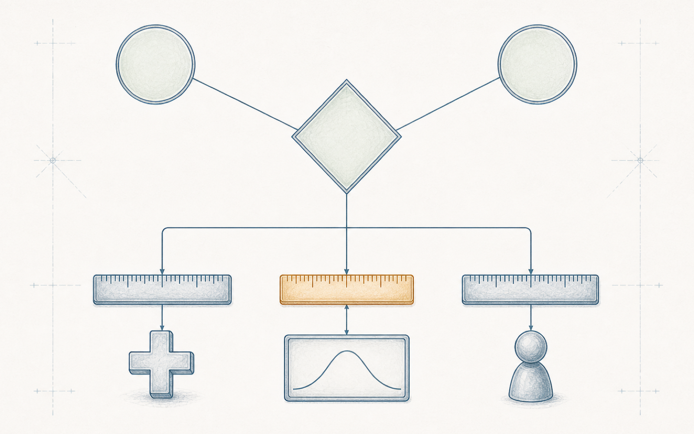

# 第 14 章 让担心可以被推理：情境与危害本体

> Semantica 绑定： 本章保存情境、危害事件和目标的概念化；唯一机器语义是
> `semantica.chapter_packages.vol2.ch14`，主场景为
> `semantica.vol2.ch14.scenario.primary`。本体、CQ、查询、Shape、正反案例、规则、
> oracle、manifest 与 receipt 全部在 Semantica。当前为 `partial`、release
> `blocked`；`semantica.chapter_packages.vol2.normative` 仅提供工程释义映射，
> 机器分级一致性不能代替标准原文核对或领域专家判断。


> **【导读】**
> 上一章把“谁说了算”画进了图里：谁有权录入、谁有权评审、谁有权裁决，各自成了
> 可以被查证的对象。可是当团队回头去找“我们究竟担心什么”时，发现这份知识还躺在
> 概念阶段的表格里——一行一个失常，一格一个字母，理由散在三份纪要和一张白板照片
> 之间。本章陪小蔡把那张表格拆开：先看表格为什么存得下结论、存不下判断；再让情境、
> 失常、事件、三个判断和目标各自成为对象；然后把概念阶段那两份白板案卷第二次开庭，
> 看同一个失常换一个情境时，机器怎样替人圈出必须重开的判断；最后回答一个更难的
> 问题——图全部自洽之后，分级就正确了吗。
> 读完本章，你应当能把风险分析表格里的任何一行，拆成情境、失常、事件、判断、
> 目标与假设各自的对象，并对其中任何一个可控性字母问出三件事：假定的动作是什么，
> 反应窗口有多长，画像里的人是谁。

## 14.1 担心被锁在表格里

试点推进到这个星期，权限的问题已经不再吵了：录入、评审、裁决各归各的对象，
机器拒绝过一次作者自评之后，没有人再把“走个流程”挂在嘴边。周二例会上，
方工带来一件旧世界的日常：一家服务站报告，维修工位上一台车的方向盘自己动了一下，
技师问要不要按安全事件上报。

这件事概念阶段其实判过。方工记得结论——车辆静止、无人在转向运动包络内的前提下，
那个维修工位事件没有人身伤害，不分配等级——但他花了两个小时才把理由凑齐。
表格在项目盘里，白板照片在某次会后有人随手拍的相册转存目录里，三份分级会纪要
两份有编号、一份只有日期；维修工位那一行甚至不在主表上，在一页“无需分级事件”
的附页里。表格写着结论，可是“无人在运动包络内”这条边界押在哪里、押着谁，
表格没有说。技师的问题恰恰踩在这条边界上：方向盘动的时候，有没有人正弯着腰？

上一章末尾大家就承认过：权限清楚了，可“担心什么”的知识还锁在表格里。
现在这把锁真的挡了一次路。会上冒出三个补救方案，每一个都值得认真对待。

有人提议给表格加两列：“理由”和“依赖”。这不外行——很多组织就是这么做的。
可试着填一下就知道：理由一落格，就成了另一段散文，机器读不出“这个字母押着
那条假设”；下次有人问“假设变了哪些行要重开”，还是要靠人把散文重读一遍。
又有人提议把纪要扫描件链接在每行后面。这解决了“找得到”，没解决“问得动”：
链接的另一端是照片，照片不回答问题。还有人提议指定一位“活字典”，让当年
参加分级会的人负责答疑。这是三个方案里最接近真相的一个，因为它承认理由住在
人的脑子里；可它也最脆弱——人会调岗、会退休，而翻遍三份纪要，当年分级会上
那三位专家连名字都没有留下，只有“碰撞安全工程师”“使用剖面工程师”
“人因工程师”三个职务。活字典找不到人来当。

**表格存得下结论，存不下结论对世界的依赖。**每个字母都是一次判断的残骸——
判断的对象、理由、证据和前提在会议室里活过一次，散会后只有字母被抄进了格子。
小蔡把概念阶段冻结下来的问题重新念了一遍，翻译成这套新载体必须回答的三个
能力问题。第一问对着情境：同一个失常出现在两个情境里，各自形成什么事件、
走向什么后果，只换情境时哪些判断必须重开？第二问对着目标：每个目标回应哪个
事件、哪种担心，通用的目标与标准意义上的安全目标怎样关联而不混同？第三问
对着假设：一条假设被推翻时，哪些分级和目标必须被点名重开，而不是悄悄留在
原地装作事实？三问都不新——它们正是当年白板案卷冻结时留下的问题，只是那时
没有任何载体能把答案查出来。

要让机器接住这三个问题，第一步不是写查询，而是让表格里挤在一行的那些词，
各自站出来成为对象。哪些词？

## 14.2 让一行表格站成七个对象

把“非预期助力／高速／S3 E4 C3／D”这一行放在解剖台上，至少压着七样东西，
每一样回答一个不同的白话问题。情境：这次判断在什么运行、环境、人群和模式的
条件边界内适用？失常行为：相对期望行为发生了什么偏差？危害事件：哪条失常在
哪个情境里展开——注意是组合，不是失常自己？后果：这条分支在明示假设下可能
走到什么结果？三个判断：分别拿什么证据，判到哪个字母？目标：为了回应这个
事件，要防止、限制或检出什么？假设：什么前提正在底下垫背？本章用 `haz:`
前缀给它们各立一个对象。

关键的一步在事件。失常本身没有等级——给“非预期助力”直接配一个等级，
正是当年白板差点犯下、后来被两幅对照图撞破的错。有资格进分级会的从来是
“失常×情境”这个组合。概念阶段的口径说得更细：失常先在整车层显形为危害，
危害再与运行情形组合成危害事件；本章把中间那环收进事件对象里，
用情境这个座位安放运行情形和它的受控条件——压缩的是写法，不是链条。
所以事件不是一个名字，而是一个带两条边的对象——
它由哪条失常、在哪个情境里组成，两条边缺一即拒。情境自己也不许偷懒成一个
字符串：“高速”两个字不是情境，车速范围、道路类型、车辆模式、周围人群和
时间边界的那组受控条件才是。条件写全了，后面“换一个条件算不算换了情境”
才有得判；写不全，两个团队会拿着同一个词各想各的路。下面这段记法把高速事件和
它名下的可控性判断立出来；注意字母在哪里：它不是行，也不是结论，
只是判断对象身上的一个属性。

```text
# 一行表格拆开后的样子（示意记法）
haz:HE_Highway a haz:HazardousEvent ;
    haz:ofMalfunction haz:MB_UnintendedAssist ;  # 失常：非预期助力
    haz:inContext     haz:CTX_Highway ;          # 情境：高速道路行驶
    haz:leadsTo       haz:CONSEQ_LaneDeparture . # 后果：偏离车道或碰撞
haz:CJ_Highway a haz:ControllabilityJudgment ;
    haz:judges       haz:HE_Highway ;            # 判断的对象是事件
    haz:level        haz:C3 ;                    # 字母只是判断的一个属性
    haz:evidenceKind haz:HumanFactorsEvidence .  # 这类判断只认人因证据
```

这段记法里最值钱的不是类名，而是最后一条边：三个判断各自绑定自己的证据类型。
严重度判断只认伤害与后果分支的证据——它的问题是“落在人身上会伤到什么程度”，
受险者不止本车驾驶员，样本要代表真正会遇到这个事件的人群。暴露概率判断只认
使用剖面的证据，而且要声明口径——按时长还是按频次；它的主语是运行情形，
不是故障，拿“传感器不常坏”来给暴露概率打折，等于用还没实现的设计替自己的
要求作证，这类证据在图里连门都进不去。可控性判断只认人因证据——它问的是
“这群人在这段窗口里做不做得成这个动作”，答案只能从真实的人身上量出来，
伤害的账和使用的账都替它答不了；动作、窗口、画像，下一节它会咬人。这不是分类洁癖：概念阶段那场分级会上，三个字母第一次
报得不一样，正是因为它们本来就是三种不同的证据问题。表格把三个问题压成三格，
图把它们还原成三个对象。

担心本身也是对象。同一个事件可以被“道路使用者的安全”评价，也可以被“服务
连续性”评价，证据和出口随之不同：前者走分级查表，后者只产生一个没有等级的
通用目标。目标因此也分两层：通用的目标说“要防止、限制或检出什么”，标准意义
上的安全目标是它在安全这条行业纵线上的投影，带着事件和等级。两者之间画一条
显式的投影边，不写等号——名字相似不是身份合并的理由，这条纪律第十二章已经
用另一场撞名乌龙付过学费。

还有一条从入门就立下的老规矩在这里继续生效：图里允许留空。当年概念阶段没有
证据给出故障容错时间，案卷里写的是“待定”；录入时它就保持一个明示的未知状态，
不许被一个漂亮的毫秒数补齐。机器判断“缺了什么”之前，先要有人声明“这部分
已经记全”——没有这句声明，空只是空，不是错。

骨架立起来了。概念阶段那两份白板案卷放进去，会发生什么？

<!-- FIG:ch14-fig01-event-and-three-rulers:OBSERVE -->
> **读图任务**：先看失常与情境如何共同构成中央事件，再沿三条下行边检查三把尺下面是否各自挂着不同类型的证据。



<!-- FIG:ch14-fig01-event-and-three-rulers:CONSUME -->
> **图后判断**：图中三把尺不产生评级数值，也不展示 ISO 26262 查表过程。它只规范事件身份与证据类型，不证明任一 ASIL 结论。

## 14.3 同一失常，第二次开庭

录入用了一个下午。AI 助手先读扫描的案卷和纪要，提议出候选对象和边；每条提议
过一遍语义检查；通过的由小蔡确认后写入；每次写入留下一条记录——谁提议、
什么检查、谁批准。助手全程没有直接改过图：它提议，机器校验，人执行，账留底。
提议也不总是对的。第一轮里助手把纪要中的“转矩传感器断线”提成了事件候选，
小蔡当场驳回——那是内部故障，不是整车层的危害，当年的案卷对此写得很清楚。
提议可以错，错得起，因为写入之前有人握着闸；这一圈下来，图里每个对象都能
回答“你是谁放进来的、凭什么”。

维修工位案卷进来时，小蔡刻意让它和高速案卷共用同一个失常对象——这正是当年
白板上的实验：不换车，不换失常，只换情境。

```text
# 小蔡录入的两份案卷（节选）
haz:HE_Workshop a haz:HazardousEvent ;
    haz:ofMalfunction haz:MB_UnintendedAssist ;   # 同一个失常对象
    haz:inContext     haz:CTX_Workshop ;          # 只有这条边不同
    haz:leadsTo       haz:CONSEQ_UnexpectedMotion .
haz:SJ_Workshop a haz:SeverityJudgment ;
    haz:judges haz:HE_Workshop ; haz:level haz:S0 ;
    haz:dependsOn haz:ASM_NoPersonInEnvelope .    # S0 押在这条边界假设上
haz:SG_NoUnintendedAssist a haz:SafetyGoal ;
    haz:respondsTo haz:HE_Highway ;
    haz:hasASIL    haz:ASIL_D .                   # 等级只挂高速事件的目标
```

服务站那个问题现在有了着落：维修工位的“无需分级”不再是表格里一句孤零零的话，
而是一个严重度判断对象，明明白白押在“无人进入运动包络”这条假设上。技师的追问
——方向盘动的时候有没有人弯着腰——正是在敲这条边。而高速事件的安全目标带着
等级挂进图里时，维修工位那条线只得到一个没有等级的通用目标：从服务连续性的
担心出发，在恢复作业前限制或检出意外转向运动。问一句“每个目标回应哪个事件、
哪种担心”，两行答案各归各位，谁也没有借谁的等级。

接着是第一个能力问题的正面回答。

问：同一个“非预期助力”失常，出现在哪些情境里，各自形成什么事件、走向什么后果？

```text
SELECT ?event ?context ?consequence
WHERE {
  ?event haz:ofMalfunction haz:MB_UnintendedAssist ;
         haz:inContext     ?context ;
         haz:leadsTo       ?consequence .
}
```

答：

| 事件 | 情境 | 后果 |
|---|---|---|
| 高速非预期助力事件 | 高速道路行驶 | 偏离车道或碰撞 |
| 维修工位非预期助力事件 | 维修工位静止 | 意外转向运动与作业中断 |

两行，不多不少。然后小蔡做了当年白板上没人能当场做的事：有人问“如果情境换成
低速拥堵排队呢？”在表格世界，防止有人把高速那行照抄过去，只有两个老办法：
在备注栏写“此行仅适用于高速”——备注靠人读，赶进度的人不读备注；或者立一条
模板规矩“复制行后必须清空分级列”——清空靠人记得，而且清空之后没有任何东西
告诉你缺了什么、该拿什么补。小蔡不用这两个办法。她新建一个情境对象，把同一个
失常挂上去，机器立刻承认第三个事件成立——但这个事件名下空空如也：没有严重度
判断，没有暴露概率判断，没有可控性判断，没有目标。查询返回的不是答案，是三把
空椅子，每把椅子还标着自己只认哪类证据。空椅子算数，靠的不是查询聪明，
而是事件这个类型自带的合同——凡是事件，三种判断各须坐满一把椅子；
判缺的资格来自这条事先写下的合同，正对得上前面那条老规矩：先有“此处必须记全”，
空才是缺。旧事件的判断一条也没有爬过来，
因为判断的边全部钉在各自的事件上。

在表格世界里，“换了情境不得复制分级”是一条要靠评审员记住的纪律；在图里，
它成了一个几何事实——旧判断根本没有边可以爬到新事件上去。**重开清单不是查询的本事，是建模时画下的每一条依赖边在付利息。**当年那位整车工程师问“你们这套措施，
精确在回答哪一件事”，现在这个问题每天都被机器替他问一遍。

机器能摆出空椅子。可一份坐进椅子的判断，它怎么分辨那是判断，还是敷衍？

## 14.4 字母背后必须站着动作、窗口和画像

高速案卷的可控性判断进来时出了岔子。助手从纪要第一页里读出“C3”，提议了一个
只有字母的判断对象。旧世界对付这种空心字母有两个办法：一是培训评审员多问一句
——概念阶段那位人因工程师就问了，问得极好，可他的问题散会就蒸发了；二是在模板
里加必填格——纸面必填拦不住空格，拦不住“抄上一行”。这一次，载体自己开了口：

```text
# 机器的拒绝报告（示意）
被检对象：haz:CJ_Highway              # 高速事件的可控性判断
合同要求：assumedAction / reactionWindow / personProfile 各恰一条
实际情况：三条全缺
结论    ：拒绝写入；C3 退回候选，不进入查表
```

小蔡补上假定动作“反打方向并制动”，再交——机器仍然拒绝，这次的报告只剩两行：
窗口缺，画像缺。缺哪样，拒哪样，一样一样地讨。有人不服气：C3 主张的本来就是
“控不住”，控不住还要什么动作和窗口？恰恰更要。说“控不住”，说的是某一群人
在某个长度的窗口里做不成某个动作——抽掉画像和窗口，这个判断换一群人、
换一种转矩上升就悄悄变了意思，而没有任何东西提醒它变了。直到小蔡翻出纪要的
第二页，才发现三样东西早就有人问齐了，白纸黑字：“你们所谓驾驶员能救回来，
假定他做什么动作、还剩多少时间？”提问的人在案卷上没有名字，只有“人因工程师”
五个字。小蔡把动作、窗口、代表性人群画像逐一录入，数据接收门禁接受了这条记录；
这只表示结构满足入账合同，不是危害评级、风险接受或产品放行。

那一刻小蔡意识到，例会上找不到的那位“活字典”其实一直都在。碰撞安全工程师的
S3 连着后果分支，使用剖面工程师那句“还没有数据”变成了一条状态为计划中的
假设，人因工程师的三连问变成了可控性判断的三条必填边。三个没有留下名字的人，
如今各自守着一类证据。问题的作者会离场，问题不再离场。

证据类型这道锁同样咬人：有人顺手把一份人因观察报告挂到暴露概率判断上，机器拒绝
——暴露概率只认使用剖面证据，还追问口径是时长还是频次；拿元件故障率来充暴露概率
证据，同样进不了门，那是另一本账。**让“字母背后必须有动作、窗口和画像”从评审员的好习惯，变成载体的拒收条件。**这就是本章对“三把尺子”的机器化：
不是替人打分，而是替人守住“没有证据对象就没有判断”这条底线。

要说破的是这道门禁的天花板：要是有人在动作栏里填一句“驾驶员注意安全”呢？
机器确实分不出空话。它锁的是部件在不在、类型对不对，不是判断好不好；空话
仍然要靠评审的人眼挑出来。而且要看到，必填栏立起来之后，空话不是变少了，
是搬了家：门禁把“合格”交给机器定义——三条边都在，就是合格——赶进度的人
自然走满足定义的最短路径，栏是机器要的，就填给机器看；形式越完备，
“填过了”越容易被错当成“想过了”，可检查的部分吸走全部注意力，
检查不到的部分自动退进暗处。但空话从此有了一个固定的位置可供挑剔——评审的人
不必再去三份纪要里找它，它就钉在判断对象的那条边上。

可是，当每一道检查都亮了绿灯，D 级就算成立了吗？

## 14.5 图的自洽，买不来分级的正确

周五评审会上，小蔡把跑完的结果投在幕上，说了一句她此刻完全有资格说的话：
“这回不一样了——图是自洽的，检查全绿。S3、E4、C3，D 级，这是机器背书过的结论。”

这句话不外行。检查是他亲手建的，每一条都咬过人；相信它们，再自然不过。
方工没有否定，只问了一个问题：“E4 的证据对象是什么？”

小蔡点开暴露概率判断。证据边的另一端不是一份车队统计，而是一条假设——
“高速使用剖面”，状态：计划中。机器要求的是“判断必须挂证据对象、类型必须匹配”，
它从头到尾没有说过、也没有能力说“这条假设为真”。图里的 E4 是一个语义合格的
候选判断，不是一个被世界证实过的事实。可控性那格更明显：动作、窗口、画像
三条边齐了，可窗口里那个秒数至今没有做过一次真实的人因试验；机器守住了
“必须有窗口”，守不住“窗口是多少”。**本体守得住语义的自洽；分级的正确，仍然要用领域证据与专家判断去买。**

小蔡沉默了一会儿，然后把幕布上那行结论亲手改成了“候选，待证据”。这不是
认输——恰恰是这套载体教他的：全绿的准确含义是“结构无可挑剔”，而结构无可
挑剔的错误结论，比结构混乱的错误结论更危险，因为它更像真的。

这正是三种来源各归各位的时刻。图管语义：判断必须成对象、必须绑对证据类型、
依赖必须画成边——违者拒收。受控的工程活动管事实：只有一次真实的使用剖面研究、
一场真实的人因试验，才能把“计划中”变成“已验证”。有权的人管决定：带着一个
候选 D 级继续往下开发，是方工在这一页上签下的风险接受，不是任何一条查询的输出。
三者少了哪一个，另外两个都会僭越。

方工随手做了个演示，把那条使用剖面假设的状态改成“已拒绝”，问机器谁受影响。

```text
SELECT ?reopened
WHERE {
  ?reopened haz:dependsOn haz:ASM_HighwayProfile .
  haz:ASM_HighwayProfile haz:status haz:Rejected .
}
```

答案三行：暴露概率判断、由它进入查表的分级结果、连同等级的安全目标。三样东西
被点名重开，一样也没有被悄悄改成新事实。当年这种影响圈只存在于最资深的人的
脑子里；现在它是任何人都能跑的一条查询。

同一个机制，第二天就接住了开场那件事。回复服务站之前，方工先在图上问：
维修工位的“无需分级”押着什么？答案一条——“无人进入运动包络”。技师说
方向盘动的时候有人正弯着腰，等于这条假设在那台车、那个工位上不成立。机器
点名严重度判断重开，“无需分级”当场收回，事件按开放项处理，谁来重判、
谁有权关闭，走的是上一章画好的那套授权关系。两个小时的翻档案，变成了
两分钟的两条查询；更要紧的是，担心第一次以对象的身份接住了现场。

边界也要试反面。小蔡把试点里那台环境监测节点的湿度漂移放进同一副骨架：
仓储趋势监测与校准台检查两个情境、同一条漂移失常、各自的后果、“测量稳定性”
的担心、两个候选目标，全部立得住——问法是通用的，当年概念阶段就验证过这一点。
可当助手依样画葫芦，提议给漂移事件也配一个等级时，机器拒绝：分级查表只在
安全担心的投影支路上存在，漂移场景没有资格进那张表——它该去找的是量程包络、
参考仪器和带时间戳的序列数据，那是另一个担心的另一套证据。骨架迁走了，
安全的量尺没有跟着走私；这道拒绝和放行同样重要，因为把等级借给不相干的领域，
是比缺一条边更隐蔽的败坏。

诚实的边界要在这里说满。这张图不制造事实：它管不了高速上真实的伤害分布，
管不了真实驾驶员还剩几秒；它也不拥有决定权：全绿只表示这张局部图对已经写下的
问题给出了与预期一致的回答，放行、验证、授权都在图外。本章示意结构的唯一机器
投影位于 `semantica.chapter_packages.vol2.ch14`。它可以运行 manifest 声明的正反
案例、查询与 oracle，却仍标为 `partial`，release 仍为 `blocked`；所以这里能说的
是“受限场景可被复核”，不能说“完整实现已经通过”。

散会前方工在图上停了一下：危害定下了目标——目标现在是一个对象，带着事件、
等级和一身假设。可它马上要离开概念阶段了。目标离开这间屋子之后，怎样不丢？

## 14.6 目标出发去下一站

当年白板上那三样东西——双信号比较、关断、告警——在这张图里依然没有位置，
这一次不是被纪律拦住，而是被结构拦住：它们是回应目标的候选实现，属于需求的
世界，不属于危害的世界。图替当年的评审会守住了那条最容易破的线：先说清担心
什么、要达到什么，再让方案来竞争。

方工在散会前提醒了一句更远的事。目标接下来要走的路，他见过它在表格世界里
怎么丢：一条目标派生成十几条需求，分配给系统、硬件、软件，每一次转手都合理，
合起来却没有人能回答“这条需求究竟在替哪条目标作证”；等到某个数字丢了条件、
某个接口丢了单位，追回去的路已经断了。危害的图到目标为止；目标之后的每一步
转手，需要它自己的对象和边。

你可以现在就做一次本章的动作：拿你自己项目里风险表格的任何一行，把它拆成
情境、失常、事件、三个判断、目标、假设七样对象，再对那个可控性字母问三件事
——动作、窗口、画像。拆不动的地方，就是你的担心被锁住的地方。这也是导读那张
期票的兑现：一行表格，七个对象，三个问题。

散会后小蔡做了一件小事：把那张白板照片重新扫描，挂进案卷对象的来源边里。
照片还是那张照片，上面还是当年那几笔没擦干净的方案；但它第一次有了地址，
有了指向它的问题，有了会替它守夜的门禁。写下它的人没有留下名字，
写下的东西留了下来。

而下一站的难题已经在桌上。目标从这里出发，要被派生成需求、分配给系统、硬件
与软件，在一层层转手中穿过接口和预算——在表格的世界里，目标恰恰就是在那条
路上丢的。承诺怎样不丢地流进需求？下一章，让追溯自己长出边来。

---

> **本章注记**：本章人物、事故、案卷与全部编号均为合成教学材料；EPS 与环境监测
> 节点的情境、判断和等级不描述任何现实产品。正文片段只用于教学；唯一可执行版本是
> `semantica.chapter_packages.vol2.ch14`，当前为 `partial`、release `blocked`。
> 场景 oracle 通过只表示局部图对已编码问题的回答与预期一致，不证明现实分级正确、
> 目标充分或任何工程决定成立。
