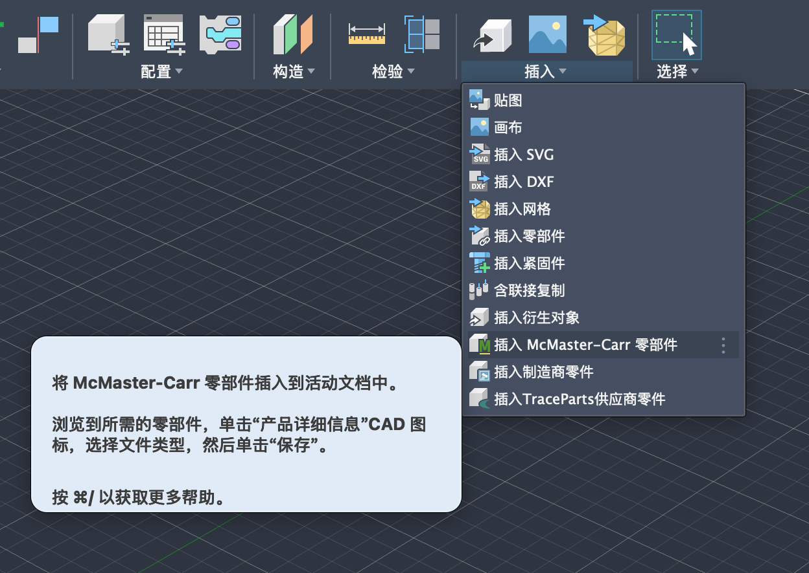

# Fusion 中文界面：McMaster-Carr 入口

> Historical McMaster/Fusion reference only. Current purchased-part default is misumi-cn-guide.md; do not route new work to Fusion or McMaster from this guide.

需要在 Fusion 中查找、下载供应商标准件时，先确认目标实例与文档，再从
**实体 → 插入 → 插入 McMaster-Carr 零部件**进入目录。
英文菜单项为 **Insert McMaster-Carr Component**。

上图由用户于 2026-09-25 提供，原始 PNG 已原样保存。它证明该菜单入口可见，
不表示目录已打开、零件已下载或模型已插入；截图未显示版本号或文档身份。

1. 使用本任务已绑定并保存的文档；多实例时先按
   [实例与文档隔离规则](fusion-multi-instance.md)核对所属进程。
2. 点击图中的 **插入 McMaster-Carr 零部件**，等待供应商目录窗口加载。
   旁边的“插入紧固件”“插入制造商零件”和“插入 TraceParts 供应商零件”
   是不同入口。
3. 目录打开后，按[供应商 CAD 获取流程](supplier-cad-acquisition.md)查询
   规格和货号；具体搜索、精确选择 **3-D STEP**、下载与溯源使用
   [Fusion 执行规则中的 McMaster 工具](fusion-execution.md#供应商标准件获取mcmaster-carr)。

当前 MCP 守卫禁止在事务中启动该交互命令，首次打开方式沿用上述执行规则。
此图仅补充入口定位，不改变自动化权限或保存纪律。

零件的规格、配合、载荷与行程仍需逐项核对；下载后的导入、原生几何回读和
保存验证分别完成。图片[来源与完整性记录](images/mcmaster-fusion-cn-entry-20260925.provenance.json)
与原图一同保留。
